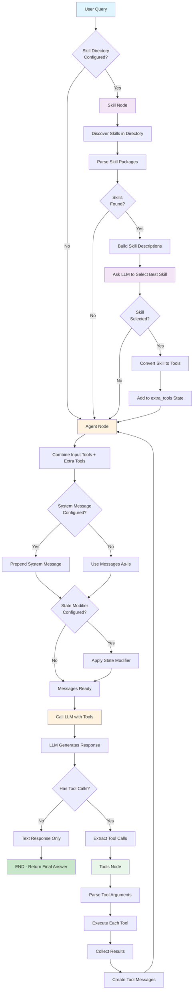
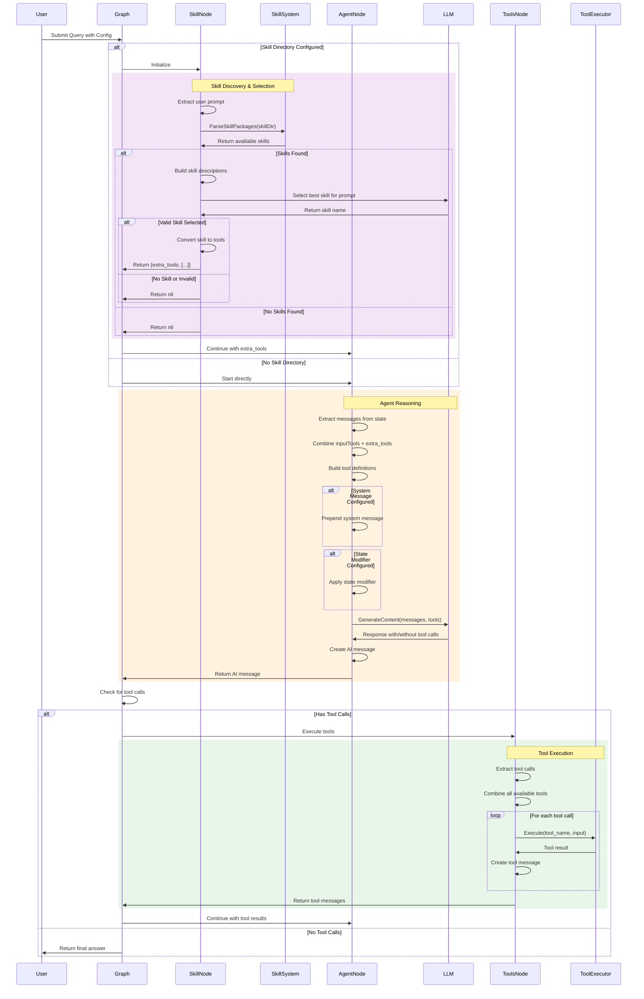
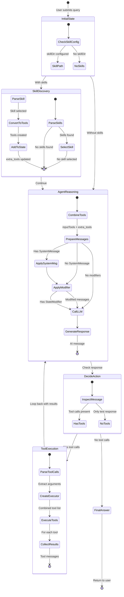

# CreateAgent - Flexible Agent with Skill Discovery

## Table of Contents

- [Overview](#overview)
- [What is CreateAgent?](#what-is-createagent)
- [Architecture](#architecture)
- [How It Works](#how-it-works)
- [API Reference](#api-reference)
- [Usage Guide](#usage-guide)
- [Skill System](#skill-system)
- [Examples](#examples)
- [Best Practices](#best-practices)
- [Comparison with Other Patterns](#comparison-with-other-patterns)
- [Advanced Usage](#advanced-usage)

## Overview

**CreateAgent** is a flexible agent creation function that extends the basic ReAct pattern with optional skill discovery, dynamic tool loading, and extensive configuration options. It's designed for scenarios where you need more control over agent behavior and want to leverage reusable skill packages.

### Key Features

- ✅ **Skill Discovery**: Automatically discover and load skills from directories
- ✅ **Dynamic Tool Loading**: Load tools on-the-fly based on user queries
- ✅ **Flexible Configuration**: System messages, state modifiers, verbosity control
- ✅ **Tool Composition**: Combine static tools with dynamically loaded skill tools
- ✅ **Checkpoint Support**: Save and resume agent state (experimental)
- ✅ **Extensible**: Easy to customize with options pattern

## What is CreateAgent?

CreateAgent is an enhanced version of the ReAct agent that adds:

1. **Optional Skill Node**: Discovers relevant skills and loads their tools dynamically
2. **Configurable Agent Behavior**: System messages, state modifiers, verbose output
3. **Hybrid Tool Sets**: Combines pre-defined tools with skill-based tools
4. **Production Features**: Checkpointing, state management, error handling

### CreateAgent vs CreateReactAgent

**CreateReactAgent** (Simple):
```
User Query → Agent Node → Tools Node → ... → Final Answer
```

**CreateAgent** (With Skills):
```
User Query → Skill Discovery → Skill Selection → Load Tools
                ↓
          Agent Node → Tools Node → ... → Final Answer
```

**CreateAgent** (Without Skills):
```
User Query → Agent Node → Tools Node → ... → Final Answer
+ System Message + State Modifier + Verbose Mode
```

## Architecture

```
┌───────────────────────────────────────────────────────────────┐
│                      CreateAgent                              │
├───────────────────────────────────────────────────────────────┤
│                                                               │
│  ┌──────────────┐    ┌──────────────┐    ┌──────────────┐  │
│  │ Skill Node   │───▶│ Agent Node   │───▶│ Tools Node   │  │
│  │ (Optional)   │    │  (Required)  │◀───│  (Required)  │  │
│  └──────────────┘    └──────────────┘    └──────────────┘  │
│        │                    │                    │           │
│        ▼                    ▼                    ▼           │
│  • Discover Skills    • LLM Reasoning     • Execute Tools   │
│  • Select Best Skill  • Tool Selection    • Collect Results │
│  • Load Tools         • System Message    • Handle Errors   │
│                       • State Modifier                       │
│                                                               │
│  State: {                                                     │
│    messages: [...],      // Conversation history            │
│    extra_tools: [...]    // Dynamically loaded tools        │
│  }                                                            │
│                                                               │
│  Configuration Options:                                       │
│  • WithSystemMessage(msg)                                    │
│  • WithStateModifier(fn)                                     │
│  • WithSkillDir(path)                                        │
│  • WithVerbose(bool)                                         │
│  • WithCheckpointer(store)                                   │
│                                                               │
└───────────────────────────────────────────────────────────────┘
```

### Components

1. **Skill Node** (Optional):
   - Discovers available skills in specified directory
   - Uses LLM to select most relevant skill
   - Converts skill to tools
   - Adds tools to `extra_tools` state

2. **Agent Node**:
   - Receives conversation history
   - Combines input tools + extra tools
   - Applies system message if configured
   - Applies state modifier if configured
   - Calls LLM with all available tools
   - Decides: Use tool OR provide final answer

3. **Tools Node**:
   - Executes tool calls from AI message
   - Works with both input tools and extra tools
   - Creates tool result messages
   - Returns to agent node

4. **State Schema**:
   - `messages`: Conversation history (AppendReducer)
   - `extra_tools`: Dynamically loaded tools (AppendReducer)

## How It Works

### Complete Workflow Diagram



### Detailed Sequence Diagram



### State Evolution Diagram



## API Reference

### CreateAgent

Creates a new agent with optional skill discovery and configuration.

```go
func CreateAgent(model llms.Model, inputTools []tools.Tool, opts ...CreateAgentOption) (*graph.StateRunnable, error)
```

#### Parameters

- **model** (`llms.Model`): The LLM to use for reasoning (required)
  - Must support tool calling
  - Used for both skill selection and agent reasoning

- **inputTools** (`[]tools.Tool`): Static tools available to agent (required)
  - Can be empty slice
  - Combined with skill tools if skills are used

- **opts** (`...CreateAgentOption`): Configuration options (variadic)
  - See Configuration Options below

#### Returns

- **`*graph.StateRunnable`**: Compiled agent ready to execute
- **`error`**: Error if creation fails

### Configuration Options

#### WithSystemMessage

Sets a system message that guides agent behavior.

```go
func WithSystemMessage(message string) CreateAgentOption
```

**Example**:
```go
agent, _ := prebuilt.CreateAgent(model, tools,
    prebuilt.WithSystemMessage("You are a helpful research assistant."),
)
```

#### WithStateModifier

Sets a function to modify messages before sending to LLM.

```go
func WithStateModifier(modifier func(messages []llms.MessageContent) []llms.MessageContent) CreateAgentOption
```

**Use Cases**:
- Filtering old messages to save tokens
- Removing certain message types
- Reformatting message content
- Adding context dynamically

**Example**:
```go
agent, _ := prebuilt.CreateAgent(model, tools,
    prebuilt.WithStateModifier(func(msgs []llms.MessageContent) []llms.MessageContent {
        // Keep only last 10 messages
        if len(msgs) > 10 {
            return msgs[len(msgs)-10:]
        }
        return msgs
    }),
)
```

#### WithSkillDir

Enables skill discovery from a directory.

```go
func WithSkillDir(skillDir string) CreateAgentOption
```

**Example**:
```go
agent, _ := prebuilt.CreateAgent(model, tools,
    prebuilt.WithSkillDir("./skills"),
)
```

**Requirements**:
- Directory must contain valid skill packages
- Skills must follow goskills format
- Each skill has metadata (name, description)

#### WithVerbose

Enables verbose logging for debugging.

```go
func WithVerbose(verbose bool) CreateAgentOption
```

**Example**:
```go
agent, _ := prebuilt.CreateAgent(model, tools,
    prebuilt.WithVerbose(true),
)
```

**Output**:
```
🔎 Discovering available skills in ./skills...
✅ Found 3 skills.
🧠 Asking LLM to select the best skill...
✅ LLM selected skill: web_search
```

#### WithCheckpointer

Sets a checkpoint store for saving/resuming agent state (experimental).

```go
func WithCheckpointer(checkpointer graph.CheckpointStore) CreateAgentOption
```

**Note**: This is currently a placeholder and may not be fully integrated.

## Usage Guide

### Basic Usage (Without Skills)

```go
package main

import (
    "context"
    "fmt"
    "log"

    "github.com/smallnest/langgraphgo/prebuilt"
    "github.com/tmc/langchaingo/llms"
    "github.com/tmc/langchaingo/llms/openai"
    "github.com/tmc/langchaingo/tools"
)

func main() {
    // 1. Create LLM
    model, err := openai.New(openai.WithModel("gpt-4"))
    if err != nil {
        log.Fatal(err)
    }

    // 2. Define tools
    tools := []tools.Tool{
        WeatherTool{},
        CalculatorTool{},
    }

    // 3. Create agent with configuration
    agent, err := prebuilt.CreateAgent(model, tools,
        prebuilt.WithSystemMessage("You are a helpful assistant."),
        prebuilt.WithVerbose(true),
    )
    if err != nil {
        log.Fatal(err)
    }

    // 4. Prepare initial state
    initialState := map[string]interface{}{
        "messages": []llms.MessageContent{
            llms.TextParts(llms.ChatMessageTypeHuman,
                "What's the weather in London?"),
        },
    }

    // 5. Invoke agent
    result, err := agent.Invoke(context.Background(), initialState)
    if err != nil {
        log.Fatal(err)
    }

    // 6. Extract result
    finalState := result.(map[string]interface{})
    messages := finalState["messages"].([]llms.MessageContent)
    lastMessage := messages[len(messages)-1]

    for _, part := range lastMessage.Parts {
        if textPart, ok := part.(llms.TextContent); ok {
            fmt.Println(textPart.Text)
        }
    }
}
```

### Advanced Usage (With Skills)

```go
func main() {
    model, _ := openai.New(openai.WithModel("gpt-4"))

    // Base tools always available
    baseTools := []tools.Tool{
        CalculatorTool{},
    }

    // Create agent with skill discovery
    agent, err := prebuilt.CreateAgent(model, baseTools,
        prebuilt.WithSkillDir("./skills"),
        prebuilt.WithSystemMessage("You are a research assistant with access to various skills."),
        prebuilt.WithVerbose(true),
        prebuilt.WithStateModifier(func(msgs []llms.MessageContent) []llms.MessageContent {
            // Keep only recent messages to save tokens
            if len(msgs) > 20 {
                return msgs[len(msgs)-20:]
            }
            return msgs
        }),
    )
    if err != nil {
        log.Fatal(err)
    }

    initialState := map[string]interface{}{
        "messages": []llms.MessageContent{
            llms.TextParts(llms.ChatMessageTypeHuman,
                "Find the latest news about AI and summarize it"),
        },
    }

    result, _ := agent.Invoke(context.Background(), initialState)

    // Process result...
}
```

## Skill System

### What are Skills?

Skills are reusable packages that provide:
- **Tools**: Executable functions (search, scrape, analyze, etc.)
- **Metadata**: Name, description, version
- **Dynamic Loading**: Loaded only when relevant

### Skill Structure

```
skills/
├── web_search/
│   ├── skill.star         # Skill definition
│   └── metadata.json      # Name, description
├── data_analysis/
│   ├── skill.star
│   └── metadata.json
└── code_review/
    ├── skill.star
    └── metadata.json
```

### How Skill Selection Works

1. **Discovery**: Parse all skills in `skillDir`
2. **Description**: Build list of skill names and descriptions
3. **LLM Selection**: Ask LLM which skill best matches user query
4. **Conversion**: Convert selected skill to tools
5. **Integration**: Add tools to `extra_tools` state

### Creating Custom Skills

See [goskills documentation](https://github.com/smallnest/goskills) for creating custom skills.

**Example skill metadata**:
```json
{
  "name": "web_search",
  "description": "Search the web for current information, news, and facts",
  "version": "1.0.0"
}
```

## Examples

### Example 1: Simple Agent with System Message

```go
agent, _ := prebuilt.CreateAgent(model, tools,
    prebuilt.WithSystemMessage("You are a math tutor. Explain each step clearly."),
)

initialState := map[string]interface{}{
    "messages": []llms.MessageContent{
        llms.TextParts(llms.ChatMessageTypeHuman,
            "Solve: 2x + 5 = 13"),
    },
}

result, _ := agent.Invoke(ctx, initialState)
```

**Agent Behavior**: Will explain step-by-step and use calculator tool

### Example 2: Research Agent with Skills

```go
agent, _ := prebuilt.CreateAgent(model, []tools.Tool{},
    prebuilt.WithSkillDir("./research_skills"),
    prebuilt.WithSystemMessage("You are a research assistant."),
    prebuilt.WithVerbose(true),
)

initialState := map[string]interface{}{
    "messages": []llms.MessageContent{
        llms.TextParts(llms.ChatMessageTypeHuman,
            "What are the latest developments in quantum computing?"),
    },
}
```

**Workflow**:
1. Discovers skills: `web_search`, `arxiv_search`, `summarizer`
2. LLM selects: `arxiv_search` (most relevant for quantum computing)
3. Loads arxiv_search tools
4. Uses tools to find papers
5. Provides comprehensive answer

### Example 3: Token-Efficient Agent

```go
agent, _ := prebuilt.CreateAgent(model, tools,
    prebuilt.WithStateModifier(func(msgs []llms.MessageContent) []llms.MessageContent {
        // Keep system message + last 5 exchanges
        var filtered []llms.MessageContent

        // Keep system message
        if len(msgs) > 0 && msgs[0].Role == llms.ChatMessageTypeSystem {
            filtered = append(filtered, msgs[0])
            msgs = msgs[1:]
        }

        // Keep last 10 messages (5 exchanges)
        if len(msgs) > 10 {
            msgs = msgs[len(msgs)-10:]
        }

        return append(filtered, msgs...)
    }),
)
```

**Benefit**: Reduces token usage for long conversations

## Best Practices

### 1. Choose the Right Tool for the Job

| Need | Use |
|------|-----|
| Simple tool calling | `CreateReactAgent` |
| System messages + tools | `CreateAgent` |
| Dynamic tool loading | `CreateAgent + WithSkillDir` |
| Long conversations | `CreateAgent + WithStateModifier` |

### 2. Write Clear System Messages

✅ **Good**:
```go
WithSystemMessage(`You are a code review assistant.
- Focus on security, performance, and maintainability
- Provide specific line-by-line feedback
- Suggest concrete improvements`)
```

❌ **Bad**:
```go
WithSystemMessage("You help with code")
```

### 3. Use State Modifiers Wisely

**Common Patterns**:

```go
// Keep recent messages
func keepRecent(n int) func([]llms.MessageContent) []llms.MessageContent {
    return func(msgs []llms.MessageContent) []llms.MessageContent {
        if len(msgs) > n {
            return msgs[len(msgs)-n:]
        }
        return msgs
    }
}

// Remove tool messages (keep only human/AI)
func removeToolMessages(msgs []llms.MessageContent) []llms.MessageContent {
    var filtered []llms.MessageContent
    for _, msg := range msgs {
        if msg.Role != llms.ChatMessageTypeTool {
            filtered = append(filtered, msg)
        }
    }
    return filtered
}

// Combine modifiers
agent, _ := prebuilt.CreateAgent(model, tools,
    prebuilt.WithStateModifier(func(msgs []llms.MessageContent) []llms.MessageContent {
        msgs = removeToolMessages(msgs)
        msgs = keepRecent(15)(msgs)
        return msgs
    }),
)
```

### 4. Organize Skills Effectively

**Good Structure**:
```
skills/
├── research/           # Research-related skills
│   ├── web_search/
│   ├── arxiv_search/
│   └── wikipedia/
├── data/               # Data processing skills
│   ├── csv_analysis/
│   ├── json_parser/
│   └── data_viz/
└── code/               # Code-related skills
    ├── code_review/
    ├── test_generator/
    └── documentation/
```

**Benefit**: Easier to manage, better LLM selection

### 5. Use Verbose Mode During Development

```go
agent, _ := prebuilt.CreateAgent(model, tools,
    prebuilt.WithVerbose(true),  // Enable during development
)
```

**Output helps debug**:
- Which skills were found
- Which skill was selected
- Why selection happened

### 6. Handle Skill Selection Failures

Skills might not be found or selected. Always have fallback tools:

```go
// Good: Include fallback tools
agent, _ := prebuilt.CreateAgent(model, []tools.Tool{
    SearchTool{},      // Fallback if skill search fails
    CalculatorTool{},  // Always useful
}, prebuilt.WithSkillDir("./skills"))

// Bad: Empty tools with skills
agent, _ := prebuilt.CreateAgent(model, []tools.Tool{},
    prebuilt.WithSkillDir("./skills"))  // Fails if no skill selected
```

## Comparison with Other Patterns

| Feature | CreateAgent | CreateReactAgent | Planning | Reflection |
|---------|-------------|------------------|----------|------------|
| **Complexity** | Medium | Low | High | Medium |
| **Skill Support** | Yes | No | No | No |
| **System Message** | Yes | No | No | Yes |
| **State Modifier** | Yes | No | No | No |
| **Tool Calling** | Yes | Yes | Optional | Optional |
| **Dynamic Tools** | Yes | No | No | No |
| **Setup Time** | Medium | Fast | Medium | Medium |
| **Best For** | Flexible apps | Simple tasks | Complex flows | Quality output |
| **Learning Curve** | Medium | Easy | Hard | Medium |

## Advanced Usage

### Custom Skill Selection Logic

Modify the agent to use custom skill selection:

```go
// This would require modifying the CreateAgent source
// Or wrapping the skill node in a custom graph
```

### Combining with Other Patterns

```go
// Use CreateAgent for tool calling, then Reflection for quality
agentResult := agent.Invoke(ctx, query)
reflectionInput := createReflectionInput(agentResult)
finalResult := reflectionAgent.Invoke(ctx, reflectionInput)
```

### Multi-Agent Collaboration

```go
// Research agent with skills
researchAgent := prebuilt.CreateAgent(model, nil,
    prebuilt.WithSkillDir("./research_skills"),
)

// Analysis agent with tools
analysisAgent := prebuilt.CreateAgent(model, analysisTools,
    prebuilt.WithSystemMessage("Analyze data provided by research."),
)

// Orchestrate
research := researchAgent.Invoke(ctx, query)
analysis := analysisAgent.Invoke(ctx, buildAnalysisQuery(research))
```

### Streaming with CreateAgent

```go
streamChan := make(chan map[string]interface{})

go func() {
    defer close(streamChan)
    agent.Stream(ctx, initialState, streamChan)
}()

for update := range streamChan {
    messages := update["messages"].([]llms.MessageContent)
    // Process streaming updates
}
```

## Troubleshooting

### Issue: Skills Not Found

**Symptoms**: "No skills found" message

**Solutions**:
1. Verify skill directory path exists
2. Check skill package format (goskills compatible)
3. Ensure metadata.json files exist
4. Use `WithVerbose(true)` to see discovery process

### Issue: Wrong Skill Selected

**Symptoms**: LLM selects irrelevant skill

**Solutions**:
1. Improve skill descriptions in metadata
2. Use more specific user queries
3. Reduce number of similar skills
4. Add fallback tools to inputTools

### Issue: State Modifier Breaks Agent

**Symptoms**: Agent fails or behaves unexpectedly

**Solutions**:
```go
// Always preserve system message if used
func safeModifier(msgs []llms.MessageContent) []llms.MessageContent {
    if len(msgs) == 0 {
        return msgs
    }

    // Preserve system message
    var system []llms.MessageContent
    rest := msgs
    if msgs[0].Role == llms.ChatMessageTypeSystem {
        system = msgs[:1]
        rest = msgs[1:]
    }

    // Modify rest
    if len(rest) > 10 {
        rest = rest[len(rest)-10:]
    }

    return append(system, rest...)
}
```

### Issue: High Token Usage

**Symptoms**: Expensive API calls

**Solutions**:
1. Use `WithStateModifier` to limit message history
2. Use cheaper models when possible
3. Limit number of tools
4. Remove verbose mode in production

## Performance Considerations

### Latency

**With Skills**:
- Skill discovery: ~50-100ms
- Skill selection (LLM call): ~500-2000ms
- Agent execution: Normal ReAct latency

**Without Skills**:
- Same as CreateReactAgent

**Optimization**:
- Cache skill discovery results
- Pre-select skills for known query types
- Use faster models for skill selection

### Cost

**Additional Costs with Skills**:
- 1 extra LLM call for skill selection per query
- Typically ~100-500 tokens

**Cost Reduction**:
```go
// Use cheaper model for skill selection
cheapModel := openai.New(openai.WithModel("gpt-3.5-turbo"))

// Modify CreateAgent to accept separate model for skills
// (requires source modification)
```

## Next Steps

1. **Start Simple**: Use without skills first
2. **Add System Message**: Customize agent behavior
3. **Try Skills**: Create or use existing skill packages
4. **Optimize**: Add state modifiers for long conversations
5. **Production**: Add checkpointing, error handling, monitoring

## References

- [ReAct Paper](https://arxiv.org/abs/2210.03629)
- [LangGraph Documentation](https://langchain-ai.github.io/langgraph/)
- [goskills](https://github.com/smallnest/goskills)
- [CreateReactAgent Documentation](./REACTAGENT_README.md)
- [Planning Agent Documentation](./PLANNINGAGENT_README.md)
- [Reflection Agent Documentation](./REFLECTIONAGENT_README.md)
