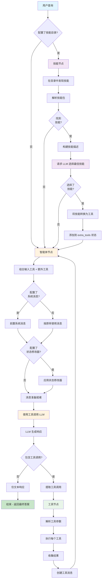
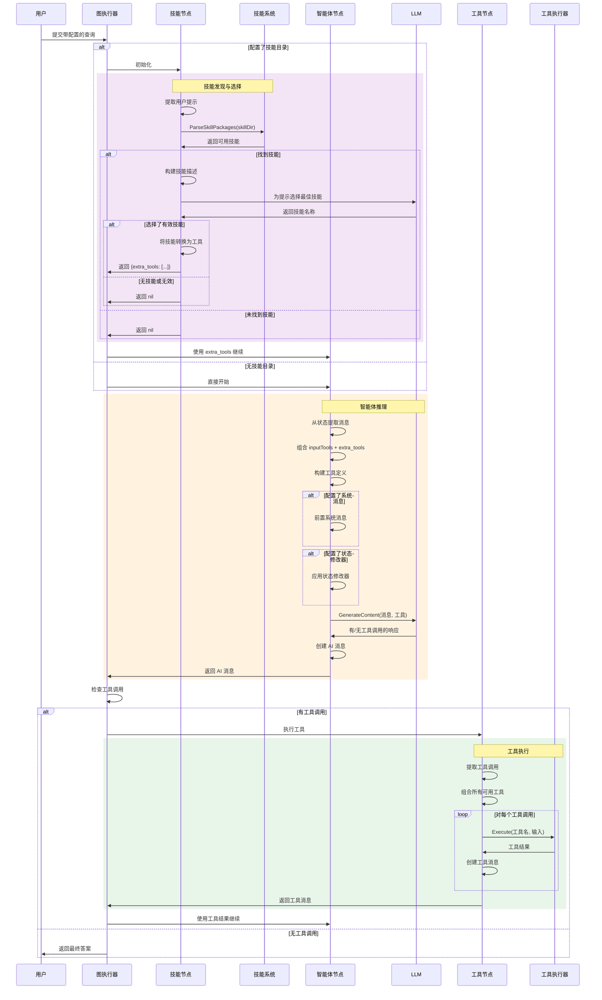
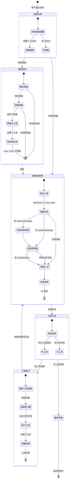

# CreateAgent - 具有技能发现的灵活智能体

## 目录

- [概述](#概述)
- [什么是 CreateAgent？](#什么是-createagent)
- [架构](#架构)
- [工作原理](#工作原理)
- [API 参考](#api-参考)
- [使用指南](#使用指南)
- [技能系统](#技能系统)
- [示例](#示例)
- [最佳实践](#最佳实践)
- [与其他模式的比较](#与其他模式的比较)
- [高级用法](#高级用法)

## 概述

**CreateAgent** 是一个灵活的智能体创建函数，它通过可选的技能发现、动态工具加载和广泛的配置选项扩展了基本的 ReAct 模式。它专为需要更多控制智能体行为并希望利用可重用技能包的场景而设计。

### 主要特性

- ✅ **技能发现**：自动从目录中发现和加载技能
- ✅ **动态工具加载**：根据用户查询动态加载工具
- ✅ **灵活配置**：系统消息、状态修改器、详细程度控制
- ✅ **工具组合**：将静态工具与动态加载的技能工具相结合
- ✅ **检查点支持**：保存和恢复智能体状态（实验性）
- ✅ **可扩展**：使用选项模式易于自定义

## 什么是 CreateAgent？

CreateAgent 是 ReAct 智能体的增强版本，增加了：

1. **可选技能节点**：发现相关技能并动态加载其工具
2. **可配置的智能体行为**：系统消息、状态修改器、详细输出
3. **混合工具集**：将预定义工具与基于技能的工具相结合
4. **生产功能**：检查点、状态管理、错误处理

### CreateAgent vs CreateReactAgent

**CreateReactAgent**（简单）：
```
用户查询 → 智能体节点 → 工具节点 → ... → 最终答案
```

**CreateAgent**（使用技能）：
```
用户查询 → 技能发现 → 技能选择 → 加载工具
                ↓
          智能体节点 → 工具节点 → ... → 最终答案
```

**CreateAgent**（不使用技能）：
```
用户查询 → 智能体节点 → 工具节点 → ... → 最终答案
+ 系统消息 + 状态修改器 + 详细模式
```

## 架构

```
┌───────────────────────────────────────────────────────────────┐
│                      CreateAgent                              │
├───────────────────────────────────────────────────────────────┤
│                                                               │
│  ┌──────────────┐    ┌──────────────┐    ┌──────────────┐  │
│  │  技能节点    │───▶│  智能体节点  │───▶│   工具节点   │  │
│  │  (可选)      │    │   (必需)     │◀───│   (必需)     │  │
│  └──────────────┘    └──────────────┘    └──────────────┘  │
│        │                    │                    │           │
│        ▼                    ▼                    ▼           │
│  • 发现技能          • LLM 推理          • 执行工具         │
│  • 选择最佳技能      • 工具选择          • 收集结果         │
│  • 加载工具          • 系统消息          • 处理错误         │
│                       • 状态修改器                           │
│                                                               │
│  状态: {                                                      │
│    messages: [...],      // 对话历史                         │
│    extra_tools: [...]    // 动态加载的工具                   │
│  }                                                            │
│                                                               │
│  配置选项:                                                    │
│  • WithSystemMessage(msg)                                    │
│  • WithStateModifier(fn)                                     │
│  • WithSkillDir(path)                                        │
│  • WithVerbose(bool)                                         │
│  • WithCheckpointer(store)                                   │
│                                                               │
└───────────────────────────────────────────────────────────────┘
```

### 组件

1. **技能节点**（可选）：
   - 在指定目录中发现可用技能
   - 使用 LLM 选择最相关的技能
   - 将技能转换为工具
   - 将工具添加到 `extra_tools` 状态

2. **智能体节点**：
   - 接收对话历史
   - 组合输入工具 + 额外工具
   - 如果配置了系统消息则应用
   - 如果配置了状态修改器则应用
   - 使用所有可用工具调用 LLM
   - 决定：使用工具 或 提供最终答案

3. **工具节点**：
   - 执行来自 AI 消息的工具调用
   - 处理输入工具和额外工具
   - 创建工具结果消息
   - 返回到智能体节点

4. **状态模式**：
   - `messages`：对话历史（AppendReducer）
   - `extra_tools`：动态加载的工具（AppendReducer）

## 工作原理

### 完整工作流程图



### 详细序列图



### 状态演化图



## API 参考

### CreateAgent

创建具有可选技能发现和配置的新智能体。

```go
func CreateAgent(model llms.Model, inputTools []tools.Tool, opts ...CreateAgentOption) (*graph.StateRunnable, error)
```

#### 参数

- **model** (`llms.Model`)：用于推理的 LLM（必需）
  - 必须支持工具调用
  - 用于技能选择和智能体推理

- **inputTools** (`[]tools.Tool`)：智能体可用的静态工具（必需）
  - 可以是空切片
  - 如果使用技能，则与技能工具组合

- **opts** (`...CreateAgentOption`)：配置选项（可变参数）
  - 请参阅下面的配置选项

#### 返回值

- **`*graph.StateRunnable`**：编译好的可执行智能体
- **`error`**：如果创建失败则返回错误

### 配置选项

#### WithSystemMessage

设置指导智能体行为的系统消息。

```go
func WithSystemMessage(message string) CreateAgentOption
```

**示例**：
```go
agent, _ := prebuilt.CreateAgent(model, tools,
    prebuilt.WithSystemMessage("你是一个有用的研究助手。"),
)
```

#### WithStateModifier

设置在发送到 LLM 之前修改消息的函数。

```go
func WithStateModifier(modifier func(messages []llms.MessageContent) []llms.MessageContent) CreateAgentOption
```

**用例**：
- 过滤旧消息以节省令牌
- 删除某些消息类型
- 重新格式化消息内容
- 动态添加上下文

**示例**：
```go
agent, _ := prebuilt.CreateAgent(model, tools,
    prebuilt.WithStateModifier(func(msgs []llms.MessageContent) []llms.MessageContent {
        // 只保留最后 10 条消息
        if len(msgs) > 10 {
            return msgs[len(msgs)-10:]
        }
        return msgs
    }),
)
```

#### WithSkillDir

从目录启用技能发现。

```go
func WithSkillDir(skillDir string) CreateAgentOption
```

**示例**：
```go
agent, _ := prebuilt.CreateAgent(model, tools,
    prebuilt.WithSkillDir("./skills"),
)
```

**要求**：
- 目录必须包含有效的技能包
- 技能必须遵循 goskills 格式
- 每个技能都有元数据（名称、描述）

#### WithVerbose

启用详细日志记录以进行调试。

```go
func WithVerbose(verbose bool) CreateAgentOption
```

**示例**：
```go
agent, _ := prebuilt.CreateAgent(model, tools,
    prebuilt.WithVerbose(true),
)
```

**输出**：
```
🔎 Discovering available skills in ./skills...
✅ Found 3 skills.
🧠 Asking LLM to select the best skill...
✅ LLM selected skill: web_search
```

#### WithCheckpointer

设置用于保存/恢复智能体状态的检查点存储（实验性）。

```go
func WithCheckpointer(checkpointer graph.CheckpointStore) CreateAgentOption
```

**注意**：这目前是一个占位符，可能尚未完全集成。

## 使用指南

### 基本用法（不使用技能）

```go
package main

import (
    "context"
    "fmt"
    "log"

    "github.com/smallnest/langgraphgo/prebuilt"
    "github.com/tmc/langchaingo/llms"
    "github.com/tmc/langchaingo/llms/openai"
    "github.com/tmc/langchaingo/tools"
)

func main() {
    // 1. 创建 LLM
    model, err := openai.New(openai.WithModel("gpt-4"))
    if err != nil {
        log.Fatal(err)
    }

    // 2. 定义工具
    tools := []tools.Tool{
        WeatherTool{},
        CalculatorTool{},
    }

    // 3. 使用配置创建智能体
    agent, err := prebuilt.CreateAgent(model, tools,
        prebuilt.WithSystemMessage("你是一个有用的助手。"),
        prebuilt.WithVerbose(true),
    )
    if err != nil {
        log.Fatal(err)
    }

    // 4. 准备初始状态
    initialState := map[string]interface{}{
        "messages": []llms.MessageContent{
            llms.TextParts(llms.ChatMessageTypeHuman,
                "伦敦的天气怎么样？"),
        },
    }

    // 5. 调用智能体
    result, err := agent.Invoke(context.Background(), initialState)
    if err != nil {
        log.Fatal(err)
    }

    // 6. 提取结果
    finalState := result.(map[string]interface{})
    messages := finalState["messages"].([]llms.MessageContent)
    lastMessage := messages[len(messages)-1]

    for _, part := range lastMessage.Parts {
        if textPart, ok := part.(llms.TextContent); ok {
            fmt.Println(textPart.Text)
        }
    }
}
```

### 高级用法（使用技能）

```go
func main() {
    model, _ := openai.New(openai.WithModel("gpt-4"))

    // 始终可用的基础工具
    baseTools := []tools.Tool{
        CalculatorTool{},
    }

    // 使用技能发现创建智能体
    agent, err := prebuilt.CreateAgent(model, baseTools,
        prebuilt.WithSkillDir("./skills"),
        prebuilt.WithSystemMessage("你是一个可以访问各种技能的研究助手。"),
        prebuilt.WithVerbose(true),
        prebuilt.WithStateModifier(func(msgs []llms.MessageContent) []llms.MessageContent {
            // 只保留最近的消息以节省令牌
            if len(msgs) > 20 {
                return msgs[len(msgs)-20:]
            }
            return msgs
        }),
    )
    if err != nil {
        log.Fatal(err)
    }

    initialState := map[string]interface{}{
        "messages": []llms.MessageContent{
            llms.TextParts(llms.ChatMessageTypeHuman,
                "查找关于 AI 的最新新闻并总结"),
        },
    }

    result, _ := agent.Invoke(context.Background(), initialState)

    // 处理结果...
}
```

## 技能系统

### 什么是技能？

技能是提供以下功能的可重用包：
- **工具**：可执行函数（搜索、抓取、分析等）
- **元数据**：名称、描述、版本
- **动态加载**：仅在相关时加载

### 技能结构

```
skills/
├── web_search/
│   ├── skill.star         # 技能定义
│   └── metadata.json      # 名称、描述
├── data_analysis/
│   ├── skill.star
│   └── metadata.json
└── code_review/
    ├── skill.star
    └── metadata.json
```

### 技能选择的工作原理

1. **发现**：解析 `skillDir` 中的所有技能
2. **描述**：构建技能名称和描述列表
3. **LLM 选择**：询问 LLM 哪个技能最匹配用户查询
4. **转换**：将选定的技能转换为工具
5. **集成**：将工具添加到 `extra_tools` 状态

### 创建自定义技能

有关创建自定义技能的信息，请参阅 [goskills 文档](https://github.com/smallnest/goskills)。

**示例技能元数据**：
```json
{
  "name": "web_search",
  "description": "搜索网络以获取当前信息、新闻和事实",
  "version": "1.0.0"
}
```

## 示例

### 示例 1：带系统消息的简单智能体

```go
agent, _ := prebuilt.CreateAgent(model, tools,
    prebuilt.WithSystemMessage("你是一位数学导师。清楚地解释每一步。"),
)

initialState := map[string]interface{}{
    "messages": []llms.MessageContent{
        llms.TextParts(llms.ChatMessageTypeHuman,
            "求解：2x + 5 = 13"),
    },
}

result, _ := agent.Invoke(ctx, initialState)
```

**智能体行为**：将逐步解释并使用计算器工具

### 示例 2：带技能的研究智能体

```go
agent, _ := prebuilt.CreateAgent(model, []tools.Tool{},
    prebuilt.WithSkillDir("./research_skills"),
    prebuilt.WithSystemMessage("你是一个研究助手。"),
    prebuilt.WithVerbose(true),
)

initialState := map[string]interface{}{
    "messages": []llms.MessageContent{
        llms.TextParts(llms.ChatMessageTypeHuman,
            "量子计算的最新发展是什么？"),
    },
}
```

**工作流程**：
1. 发现技能：`web_search`、`arxiv_search`、`summarizer`
2. LLM 选择：`arxiv_search`（与量子计算最相关）
3. 加载 arxiv_search 工具
4. 使用工具查找论文
5. 提供全面答案

### 示例 3：令牌高效智能体

```go
agent, _ := prebuilt.CreateAgent(model, tools,
    prebuilt.WithStateModifier(func(msgs []llms.MessageContent) []llms.MessageContent {
        // 保留系统消息 + 最后 5 次交换
        var filtered []llms.MessageContent

        // 保留系统消息
        if len(msgs) > 0 && msgs[0].Role == llms.ChatMessageTypeSystem {
            filtered = append(filtered, msgs[0])
            msgs = msgs[1:]
        }

        // 保留最后 10 条消息（5 次交换）
        if len(msgs) > 10 {
            msgs = msgs[len(msgs)-10:]
        }

        return append(filtered, msgs...)
    }),
)
```

**好处**：减少长对话的令牌使用

## 最佳实践

### 1. 选择合适的工具

| 需求 | 使用 |
|------|------|
| 简单工具调用 | `CreateReactAgent` |
| 系统消息 + 工具 | `CreateAgent` |
| 动态工具加载 | `CreateAgent + WithSkillDir` |
| 长对话 | `CreateAgent + WithStateModifier` |

### 2. 编写清晰的系统消息

✅ **好的做法**：
```go
WithSystemMessage(`你是一个代码审查助手。
- 专注于安全性、性能和可维护性
- 提供具体的逐行反馈
- 建议具体的改进`)
```

❌ **不好的做法**：
```go
WithSystemMessage("你帮助处理代码")
```

### 3. 明智地使用状态修改器

**常见模式**：

```go
// 保留最近的消息
func keepRecent(n int) func([]llms.MessageContent) []llms.MessageContent {
    return func(msgs []llms.MessageContent) []llms.MessageContent {
        if len(msgs) > n {
            return msgs[len(msgs)-n:]
        }
        return msgs
    }
}

// 删除工具消息（仅保留人类/AI）
func removeToolMessages(msgs []llms.MessageContent) []llms.MessageContent {
    var filtered []llms.MessageContent
    for _, msg := range msgs {
        if msg.Role != llms.ChatMessageTypeTool {
            filtered = append(filtered, msg)
        }
    }
    return filtered
}

// 组合修改器
agent, _ := prebuilt.CreateAgent(model, tools,
    prebuilt.WithStateModifier(func(msgs []llms.MessageContent) []llms.MessageContent {
        msgs = removeToolMessages(msgs)
        msgs = keepRecent(15)(msgs)
        return msgs
    }),
)
```

### 4. 有效组织技能

**良好结构**：
```
skills/
├── research/           # 研究相关技能
│   ├── web_search/
│   ├── arxiv_search/
│   └── wikipedia/
├── data/               # 数据处理技能
│   ├── csv_analysis/
│   ├── json_parser/
│   └── data_viz/
└── code/               # 代码相关技能
    ├── code_review/
    ├── test_generator/
    └── documentation/
```

**好处**：更易于管理，更好的 LLM 选择

### 5. 在开发过程中使用详细模式

```go
agent, _ := prebuilt.CreateAgent(model, tools,
    prebuilt.WithVerbose(true),  // 在开发期间启用
)
```

**输出有助于调试**：
- 找到了哪些技能
- 选择了哪个技能
- 为什么发生选择

### 6. 处理技能选择失败

可能找不到或选择不到技能。始终有后备工具：

```go
// 好：包括后备工具
agent, _ := prebuilt.CreateAgent(model, []tools.Tool{
    SearchTool{},      // 如果技能搜索失败的后备
    CalculatorTool{},  // 总是有用的
}, prebuilt.WithSkillDir("./skills"))

// 不好：使用技能的空工具
agent, _ := prebuilt.CreateAgent(model, []tools.Tool{},
    prebuilt.WithSkillDir("./skills"))  // 如果没有选择技能则失败
```

## 与其他模式的比较

| 特性 | CreateAgent | CreateReactAgent | Planning | Reflection |
|------|-------------|------------------|----------|------------|
| **复杂度** | 中等 | 低 | 高 | 中等 |
| **技能支持** | 是 | 否 | 否 | 否 |
| **系统消息** | 是 | 否 | 否 | 是 |
| **状态修改器** | 是 | 否 | 否 | 否 |
| **工具调用** | 是 | 是 | 可选 | 可选 |
| **动态工具** | 是 | 否 | 否 | 否 |
| **设置时间** | 中等 | 快速 | 中等 | 中等 |
| **最适合** | 灵活应用 | 简单任务 | 复杂流程 | 质量输出 |
| **学习曲线** | 中等 | 容易 | 困难 | 中等 |

## 高级用法

### 自定义技能选择逻辑

修改智能体以使用自定义技能选择：

```go
// 这需要修改 CreateAgent 源代码
// 或将技能节点包装在自定义图中
```

### 与其他模式组合

```go
// 使用 CreateAgent 进行工具调用，然后使用 Reflection 提高质量
agentResult := agent.Invoke(ctx, query)
reflectionInput := createReflectionInput(agentResult)
finalResult := reflectionAgent.Invoke(ctx, reflectionInput)
```

### 多智能体协作

```go
// 带技能的研究智能体
researchAgent := prebuilt.CreateAgent(model, nil,
    prebuilt.WithSkillDir("./research_skills"),
)

// 带工具的分析智能体
analysisAgent := prebuilt.CreateAgent(model, analysisTools,
    prebuilt.WithSystemMessage("分析研究提供的数据。"),
)

// 编排
research := researchAgent.Invoke(ctx, query)
analysis := analysisAgent.Invoke(ctx, buildAnalysisQuery(research))
```

### 使用 CreateAgent 进行流式传输

```go
streamChan := make(chan map[string]interface{})

go func() {
    defer close(streamChan)
    agent.Stream(ctx, initialState, streamChan)
}()

for update := range streamChan {
    messages := update["messages"].([]llms.MessageContent)
    // 处理流式更新
}
```

## 故障排除

### 问题：未找到技能

**症状**："未找到技能"消息

**解决方案**：
1. 验证技能目录路径存在
2. 检查技能包格式（兼容 goskills）
3. 确保存在 metadata.json 文件
4. 使用 `WithVerbose(true)` 查看发现过程

### 问题：选择了错误的技能

**症状**：LLM 选择了不相关的技能

**解决方案**：
1. 改进元数据中的技能描述
2. 使用更具体的用户查询
3. 减少类似技能的数量
4. 向 inputTools 添加后备工具

### 问题：状态修改器破坏智能体

**症状**：智能体失败或行为异常

**解决方案**：
```go
// 如果使用了系统消息，始终保留它
func safeModifier(msgs []llms.MessageContent) []llms.MessageContent {
    if len(msgs) == 0 {
        return msgs
    }

    // 保留系统消息
    var system []llms.MessageContent
    rest := msgs
    if msgs[0].Role == llms.ChatMessageTypeSystem {
        system = msgs[:1]
        rest = msgs[1:]
    }

    // 修改其余部分
    if len(rest) > 10 {
        rest = rest[len(rest)-10:]
    }

    return append(system, rest...)
}
```

### 问题：令牌使用量高

**症状**：昂贵的 API 调用

**解决方案**：
1. 使用 `WithStateModifier` 限制消息历史
2. 在可能的情况下使用更便宜的模型
3. 限制工具数量
4. 在生产环境中删除详细模式

## 性能考虑

### 延迟

**使用技能**：
- 技能发现：~50-100ms
- 技能选择（LLM 调用）：~500-2000ms
- 智能体执行：正常的 ReAct 延迟

**不使用技能**：
- 与 CreateReactAgent 相同

**优化**：
- 缓存技能发现结果
- 为已知查询类型预选技能
- 使用更快的模型进行技能选择

### 成本

**使用技能的额外成本**：
- 每次查询额外 1 次 LLM 调用用于技能选择
- 通常约 100-500 个令牌

**降低成本**：
```go
// 使用更便宜的模型进行技能选择
cheapModel := openai.New(openai.WithModel("gpt-3.5-turbo"))

// 修改 CreateAgent 以接受用于技能的单独模型
//（需要修改源代码）
```

## 下一步

1. **从简单开始**：首先不使用技能
2. **添加系统消息**：自定义智能体行为
3. **尝试技能**：创建或使用现有技能包
4. **优化**：为长对话添加状态修改器
5. **生产**：添加检查点、错误处理、监控

## 参考资料

- [ReAct 论文](https://arxiv.org/abs/2210.03629)
- [LangGraph 文档](https://langchain-ai.github.io/langgraph/)
- [goskills](https://github.com/smallnest/goskills)
- [CreateReactAgent 文档](./REACTAGENT_README.md)
- [Planning Agent 文档](./PLANNINGAGENT_README.md)
- [Reflection Agent 文档](./REFLECTIONAGENT_README.md)
