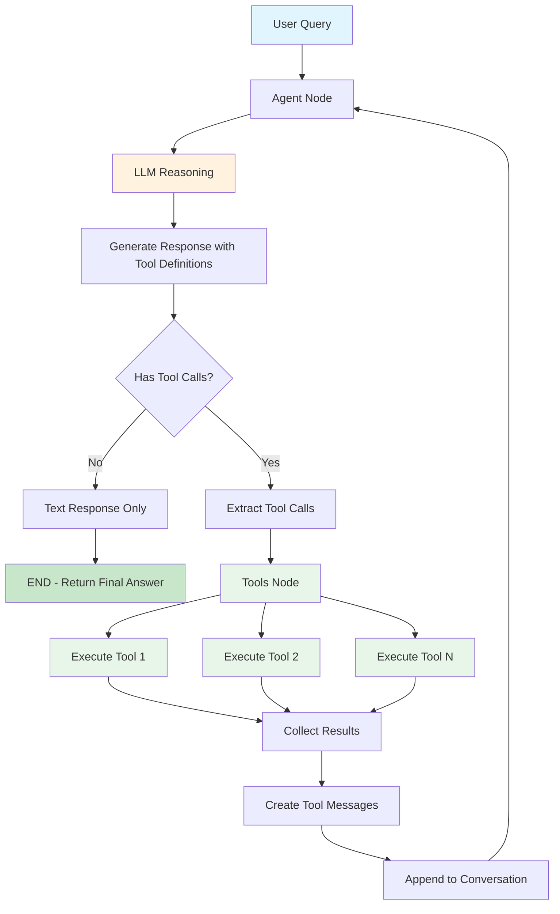
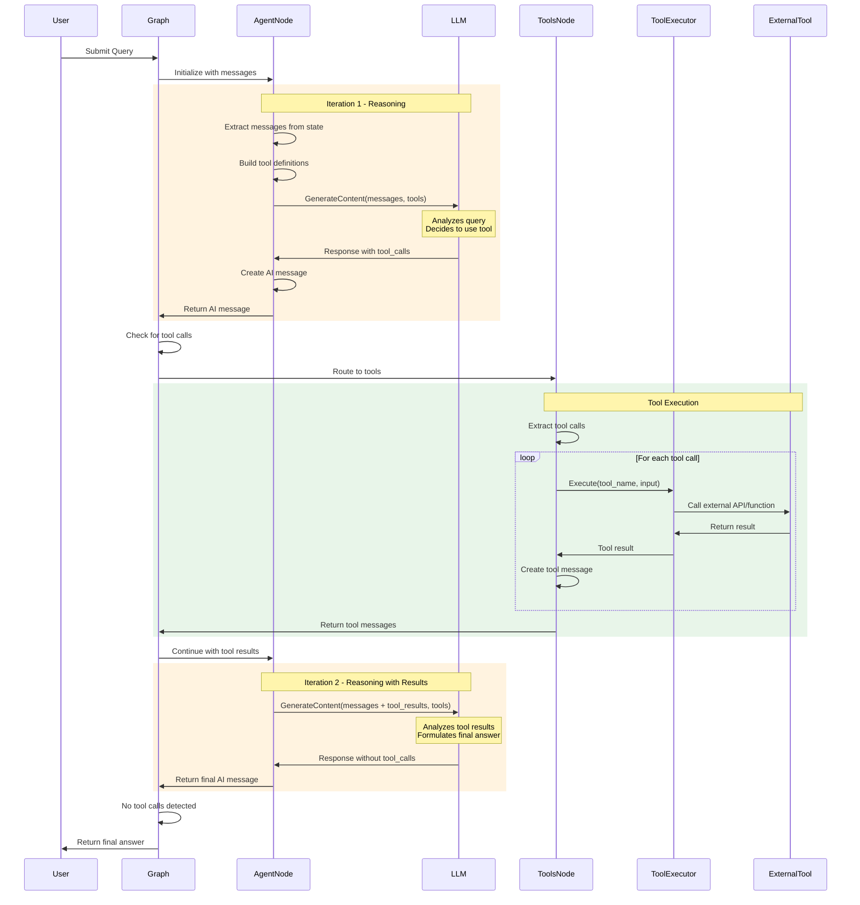
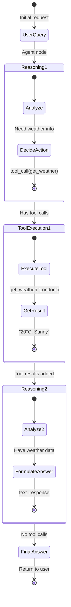

# ReAct Agent - Reasoning and Acting Pattern

## Table of Contents

- [Overview](#overview)
- [What is ReAct Pattern?](#what-is-react-pattern)
- [Architecture](#architecture)
- [How It Works](#how-it-works)
- [API Reference](#api-reference)
- [Usage Guide](#usage-guide)
- [Examples](#examples)
- [Best Practices](#best-practices)
- [Comparison with Other Patterns](#comparison-with-other-patterns)
- [Advanced Usage](#advanced-usage)

## Overview

The **ReAct Agent** (Reasoning and Acting) is a foundational agent pattern that combines LLM reasoning with tool execution. The agent iteratively reasons about what action to take, executes tools, and uses the results to inform further reasoning until it arrives at a final answer.

### Key Benefits

- ✅ **Simple and Effective**: Straightforward loop of reasoning and action
- ✅ **Tool Integration**: Seamlessly calls external tools and APIs
- ✅ **Iterative Problem Solving**: Multi-step reasoning with tool feedback
- ✅ **Flexible**: Works with any LLM that supports tool calling
- ✅ **Battle-Tested**: Widely used pattern in production
- ✅ **Easy to Debug**: Clear decision points and tool invocations

## What is ReAct Pattern?

ReAct stands for **Reasoning and Acting**. Instead of generating a final answer directly, the agent:

1. **Reasons**: Thinks about what information is needed
2. **Acts**: Calls appropriate tools to gather information
3. **Observes**: Processes tool results
4. **Repeats**: Continues until it can provide a final answer

### Traditional vs ReAct

**Traditional LLM**:
```
User Query → LLM → Answer (limited by training data)
```

**ReAct Agent**:
```
User Query → Reason → Act (Tool Call) → Observe (Tool Result)
     ↑                                          ↓
     └────────────── Repeat ←───────────────────┘
                        ↓
                  Final Answer
```

## Architecture

```
┌─────────────────────────────────────────────────────────────┐
│                     ReAct Agent                             │
├─────────────────────────────────────────────────────────────┤
│                                                             │
│  ┌──────────────┐           ┌──────────────┐              │
│  │    Agent     │──────────▶│    Tools     │              │
│  │    Node      │◀──────────│    Node      │              │
│  └──────────────┘           └──────────────┘              │
│        │                           │                       │
│        │                           │                       │
│        ▼                           ▼                       │
│   LLM Reasoning              Tool Execution                │
│   + Tool Selection           + Result Collection          │
│                                                             │
│  State: { messages: [...] }                                │
│                                                             │
└─────────────────────────────────────────────────────────────┘
```

### Components

1. **Agent Node**:
   - Receives conversation history
   - Calls LLM with tool definitions
   - Decides: Use tool OR provide final answer
   - Creates AI message with tool calls or text response

2. **Tools Node**:
   - Executes tool calls from AI message
   - Collects results from all tool invocations
   - Creates tool messages with results
   - Returns to agent node

3. **Routing Logic**:
   - After Agent: If tool calls exist → go to Tools
   - After Agent: If no tool calls → END (final answer)
   - After Tools: Always return to Agent

4. **State**:
   - `messages`: List of conversation messages
   - Messages include: Human, AI, Tool responses

## How It Works

### Complete Workflow Diagram



### Detailed Sequence Diagram



### State Evolution



## API Reference

### CreateReactAgent

Creates a new ReAct agent with the specified LLM and tools.

```go
func CreateReactAgent(model llms.Model, inputTools []tools.Tool) (*graph.StateRunnable, error)
```

#### Parameters

- **model** (`llms.Model`): The LLM to use for reasoning (required)
  - Must support tool calling (function calling)
  - Examples: GPT-4, GPT-3.5-turbo, Claude, Gemini

- **inputTools** (`[]tools.Tool`): Tools available to the agent (required)
  - Each tool must implement the `tools.Tool` interface
  - Minimum: Empty slice (agent works without tools)
  - Maximum: Limited by LLM's context window

#### Returns

- **`*graph.StateRunnable`**: Compiled agent ready to execute
- **`error`**: Error if creation fails

#### Example

```go
import (
    "github.com/smallnest/langgraphgo/prebuilt"
    "github.com/tmc/langchaingo/llms/openai"
    "github.com/tmc/langchaingo/tools"
)

// Create LLM
model, _ := openai.New(openai.WithModel("gpt-4"))

// Define tools
toolList := []tools.Tool{
    WeatherTool{},
    CalculatorTool{},
}

// Create agent
agent, err := prebuilt.CreateReactAgent(model, toolList)
```

### Tool Interface

Tools must implement the `tools.Tool` interface:

```go
type Tool interface {
    Name() string
    Description() string
    Call(ctx context.Context, input string) (string, error)
}
```

#### Example Tool Implementation

```go
type WeatherTool struct{}

func (t WeatherTool) Name() string {
    return "get_weather"
}

func (t WeatherTool) Description() string {
    return "Get current weather for a city. Input should be city name."
}

func (t WeatherTool) Call(ctx context.Context, input string) (string, error) {
    // Call weather API
    weather := getWeatherFromAPI(input)
    return fmt.Sprintf("Weather in %s: %s", input, weather), nil
}
```

## Usage Guide

### Step 1: Create LLM and Tools

```go
package main

import (
    "context"
    "github.com/smallnest/langgraphgo/prebuilt"
    "github.com/tmc/langchaingo/llms/openai"
    "github.com/tmc/langchaingo/tools"
)

func main() {
    // Create LLM
    model, err := openai.New(openai.WithModel("gpt-4"))
    if err != nil {
        log.Fatal(err)
    }

    // Define tools
    tools := []tools.Tool{
        WeatherTool{},
        CalculatorTool{},
        SearchTool{},
    }
}
```

### Step 2: Create ReAct Agent

```go
agent, err := prebuilt.CreateReactAgent(model, tools)
if err != nil {
    log.Fatal(err)
}
```

### Step 3: Prepare Initial State

```go
initialState := map[string]interface{}{
    "messages": []llms.MessageContent{
        {
            Role:  llms.ChatMessageTypeHuman,
            Parts: []llms.ContentPart{
                llms.TextPart("What's the weather in London?"),
            },
        },
    },
}
```

### Step 4: Invoke Agent

```go
result, err := agent.Invoke(context.Background(), initialState)
if err != nil {
    log.Fatal(err)
}
```

### Step 5: Extract Results

```go
finalState := result.(map[string]interface{})
messages := finalState["messages"].([]llms.MessageContent)

// Get final AI response
lastMessage := messages[len(messages)-1]
for _, part := range lastMessage.Parts {
    if textPart, ok := part.(llms.TextContent); ok {
        fmt.Println(textPart.Text)
    }
}
```

## Examples

### Example 1: Weather Query

```go
agent, _ := prebuilt.CreateReactAgent(model, []tools.Tool{
    WeatherTool{},
})

initialState := map[string]interface{}{
    "messages": []llms.MessageContent{
        llms.TextParts(llms.ChatMessageTypeHuman,
            "What's the weather in San Francisco?"),
    },
}

result, _ := agent.Invoke(ctx, initialState)
```

**Agent Flow:**
1. **Reason**: Need weather information for San Francisco
2. **Act**: Call `get_weather("San Francisco")`
3. **Observe**: Receive "18°C, Foggy"
4. **Final Answer**: "The weather in San Francisco is 18°C and foggy."

### Example 2: Multi-Tool Calculation

```go
agent, _ := prebuilt.CreateReactAgent(model, []tools.Tool{
    CalculatorTool{},
    SearchTool{},
})

initialState := map[string]interface{}{
    "messages": []llms.MessageContent{
        llms.TextParts(llms.ChatMessageTypeHuman,
            "What is 15% of the Eiffel Tower's height?"),
    },
}

result, _ := agent.Invoke(ctx, initialState)
```

**Agent Flow:**
1. **Reason**: Need Eiffel Tower height
2. **Act**: Call `search("Eiffel Tower height")`
3. **Observe**: "324 meters"
4. **Reason**: Calculate 15% of 324
5. **Act**: Call `calculator("324 * 0.15")`
6. **Observe**: "48.6"
7. **Final Answer**: "15% of the Eiffel Tower's height (324m) is 48.6 meters."

### Example 3: Research Task

```go
agent, _ := prebuilt.CreateReactAgent(model, []tools.Tool{
    SearchTool{},
    WebScraperTool{},
    SummarizerTool{},
})

initialState := map[string]interface{}{
    "messages": []llms.MessageContent{
        llms.TextParts(llms.ChatMessageTypeHuman,
            "Research the latest developments in quantum computing"),
    },
}
```

**Agent Flow:**
1. Search for quantum computing news
2. Scrape top result URLs
3. Summarize findings
4. Provide comprehensive answer

## Best Practices

### 1. Write Clear Tool Descriptions

The LLM uses tool descriptions to decide when to call them.

✅ **Good**:
```go
func (t WeatherTool) Description() string {
    return "Get current weather conditions for a specific city. " +
           "Input: City name (e.g., 'London', 'New York'). " +
           "Returns: Temperature, conditions, and forecast."
}
```

❌ **Bad**:
```go
func (t WeatherTool) Description() string {
    return "Gets weather"
}
```

### 2. Handle Tool Errors Gracefully

```go
func (t MyTool) Call(ctx context.Context, input string) (string, error) {
    result, err := externalAPI(input)
    if err != nil {
        // Return descriptive error message, not just error
        return fmt.Sprintf("Failed to fetch data: %v. Please try again.", err), nil
    }
    return result, nil
}
```

### 3. Limit Tool Count

Too many tools can confuse the LLM and increase latency.

- **Recommended**: 3-10 tools
- **Maximum**: ~20 tools (depends on LLM context limits)
- **Strategy**: Group related functions into single tools

### 4. Use Appropriate Models

Not all models support tool calling equally well.

| Model | Tool Support | Recommended |
|-------|-------------|-------------|
| GPT-4 | Excellent | ✅ Yes |
| GPT-3.5-turbo | Good | ✅ Yes |
| Claude 3 | Excellent | ✅ Yes |
| Gemini Pro | Good | ✅ Yes |
| Older models | Limited | ❌ No |

### 5. Validate Tool Inputs

```go
func (t CalculatorTool) Call(ctx context.Context, input string) (string, error) {
    // Validate input before execution
    if input == "" {
        return "Error: No calculation provided", nil
    }

    // Sanitize input
    input = strings.TrimSpace(input)

    // Execute safely
    result := safeCalculate(input)
    return fmt.Sprintf("%f", result), nil
}
```

### 6. Set Reasonable Timeouts

```go
ctx, cancel := context.WithTimeout(context.Background(), 30*time.Second)
defer cancel()

result, err := agent.Invoke(ctx, initialState)
```

## Comparison with Other Patterns

| Feature | ReAct | Planning | Reflection | CreateAgent |
|---------|-------|----------|------------|-------------|
| **Complexity** | Low | High | Medium | Medium |
| **Tool Use** | Yes | Optional | Optional | Yes |
| **Planning** | Implicit | Explicit | No | Optional (via skills) |
| **Refinement** | No | No | Yes | No |
| **Setup Time** | Fast | Medium | Medium | Medium |
| **Use Case** | Tool calling tasks | Complex workflows | Quality content | Flexible agents |
| **Iterations** | Variable | 1-2 | Controlled | Variable |
| **Best For** | API integrations | Multi-step processes | Writing tasks | Dynamic scenarios |

## Advanced Usage

### Custom State Management

While ReAct Agent uses simple message state, you can build on it:

```go
// Create ReAct agent
reactAgent, _ := prebuilt.CreateReactAgent(model, tools)

// Wrap in custom graph with additional state
customWorkflow := graph.NewStateGraph()
schema := graph.NewMapSchema()
schema.RegisterReducer("messages", graph.AppendReducer)
schema.RegisterReducer("metadata", graph.OverwriteReducer)
customWorkflow.SetSchema(schema)

// Add custom processing nodes
customWorkflow.AddNode("preprocess", preprocessNode)
customWorkflow.AddNode("react", reactNode)  // Wraps reactAgent
customWorkflow.AddNode("postprocess", postprocessNode)
```

### Streaming Responses

```go
// Use streaming for real-time updates
streamChan := make(chan map[string]interface{})

go func() {
    defer close(streamChan)
    err := agent.Stream(ctx, initialState, streamChan)
    if err != nil {
        log.Printf("Stream error: %v", err)
    }
}()

for update := range streamChan {
    // Process updates in real-time
    messages := update["messages"].([]llms.MessageContent)
    fmt.Printf("Update: %v\n", messages[len(messages)-1])
}
```

### Combining with Other Patterns

```go
// Use ReAct for tool calling, then Reflection for quality
reactResult := reactAgent.Invoke(ctx, query)
reflectionInput := createReflectionInput(reactResult)
finalResult := reflectionAgent.Invoke(ctx, reflectionInput)
```

### Prompt Engineering for Better Results

Add context through system messages (requires wrapping):

```go
// Use CreateAgent with system message for better control
agent, _ := prebuilt.CreateAgent(model, tools,
    prebuilt.WithSystemMessage(`You are a helpful assistant that:
    1. Always explains your reasoning
    2. Uses tools when factual information is needed
    3. Provides concise, accurate answers`),
)
```

## Troubleshooting

### Issue: Agent Doesn't Use Tools

**Symptoms**: Agent provides answer without calling tools

**Causes**:
1. Tool descriptions unclear
2. Query doesn't require tools
3. Model doesn't support tool calling well

**Solutions**:
```go
// Improve tool descriptions
func (t MyTool) Description() string {
    return "Detailed description of WHEN and HOW to use this tool. " +
           "Input format: [specify]. " +
           "Use this when: [specific scenarios]."
}

// Verify model supports tools
// Use GPT-4, GPT-3.5-turbo, or Claude 3
```

### Issue: Infinite Tool Calling Loop

**Symptoms**: Agent keeps calling tools without reaching conclusion

**Causes**:
1. Tool returns unclear results
2. Agent can't parse tool output
3. Missing information in tool response

**Solutions**:
```go
// Return structured, clear results
func (t SearchTool) Call(ctx context.Context, input string) (string, error) {
    results := search(input)

    // Format clearly
    return fmt.Sprintf("Search results for '%s':\n%s\n\nSummary: %s",
        input, results, summary), nil
}

// Add max iteration limit in wrapper
```

### Issue: Tool Calls Fail

**Symptoms**: Errors in tool execution

**Solutions**:
```go
// Add retry logic
func (t APITool) Call(ctx context.Context, input string) (string, error) {
    var result string
    var err error

    for i := 0; i < 3; i++ {
        result, err = callAPI(input)
        if err == nil {
            return result, nil
        }
        time.Sleep(time.Second * time.Duration(i+1))
    }

    return fmt.Sprintf("Failed after 3 attempts: %v", err), nil
}
```

## Performance Considerations

### Latency

- **Per iteration**: 1 LLM call + N tool calls
- **Total**: Depends on problem complexity
- **Typical**: 2-5 iterations for most tasks

### Cost Optimization

```go
// Use cheaper model when possible
model, _ := openai.New(openai.WithModel("gpt-3.5-turbo"))

// Or mix models
fastModel := openai.New(openai.WithModel("gpt-3.5-turbo"))
slowModel := openai.New(openai.WithModel("gpt-4"))

// Use fastModel for ReAct, slowModel for final refinement
```

### Parallel Tool Execution

ReAct Agent executes tools sequentially. For parallel execution:

```go
// Modify tools node to execute in parallel
// Or batch similar tool calls
```

## Next Steps

1. **Try the Examples**: Start with simple weather/calculator examples
2. **Build Custom Tools**: Create domain-specific tools
3. **Experiment with Models**: Test different LLMs
4. **Combine Patterns**: Mix ReAct with other patterns
5. **Production Deploy**: Add error handling, monitoring, logging

## References

- [ReAct Paper](https://arxiv.org/abs/2210.03629)
- [LangGraph ReAct Tutorial](https://langchain-ai.github.io/langgraph/tutorials/react/)
- [Tool Use Guide](https://python.langchain.com/docs/modules/agents/tools/)
- [CreateAgent Documentation](./CREATEAGENT_README.md)
- [Planning Agent](./PLANNINGAGENT_README.md)
