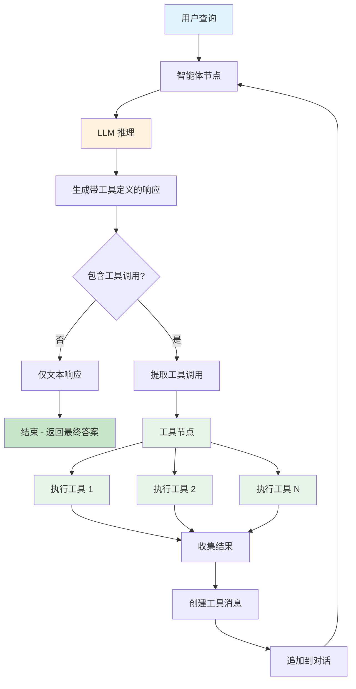
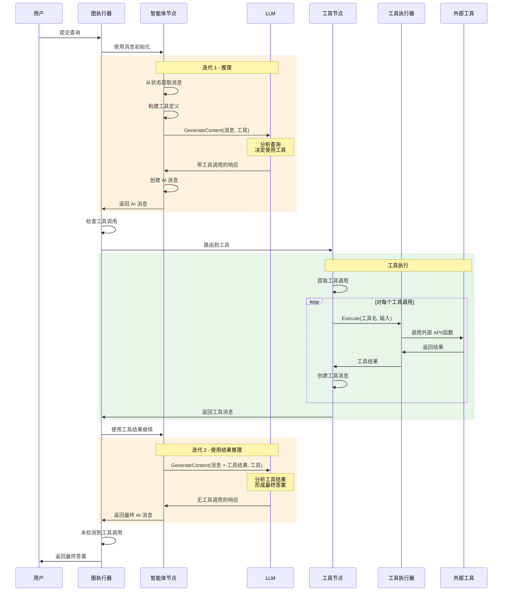
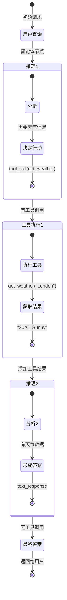

# ReAct Agent - 推理与行动模式

## 目录

- [概述](#概述)
- [什么是 ReAct 模式？](#什么是-react-模式)
- [架构](#架构)
- [工作原理](#工作原理)
- [API 参考](#api-参考)
- [使用指南](#使用指南)
- [示例](#示例)
- [最佳实践](#最佳实践)
- [与其他模式的比较](#与其他模式的比较)
- [高级用法](#高级用法)

## 概述

**ReAct Agent**（推理与行动）是一种基础的智能体模式，它将 LLM 推理与工具执行相结合。智能体迭代地推理应该采取什么行动，执行工具，并使用结果来指导进一步的推理，直到得出最终答案。

### 主要优势

- ✅ **简单高效**：推理和行动的直接循环
- ✅ **工具集成**：无缝调用外部工具和 API
- ✅ **迭代问题解决**：基于工具反馈的多步推理
- ✅ **灵活**：适用于任何支持工具调用的 LLM
- ✅ **久经考验**：在生产环境中广泛使用的模式
- ✅ **易于调试**：清晰的决策点和工具调用

## 什么是 ReAct 模式？

ReAct 代表**推理与行动**。智能体不是直接生成最终答案，而是：

1. **推理**：思考需要什么信息
2. **行动**：调用适当的工具来收集信息
3. **观察**：处理工具结果
4. **重复**：继续直到能够提供最终答案

### 传统方式 vs ReAct

**传统 LLM**：
```
用户查询 → LLM → 答案（受限于训练数据）
```

**ReAct Agent**：
```
用户查询 → 推理 → 行动（工具调用） → 观察（工具结果）
     ↑                                          ↓
     └────────────── 重复 ←───────────────────┘
                        ↓
                  最终答案
```

## 架构

```
┌─────────────────────────────────────────────────────────────┐
│                     ReAct Agent                             │
├─────────────────────────────────────────────────────────────┤
│                                                             │
│  ┌──────────────┐           ┌──────────────┐              │
│  │  智能体节点  │──────────▶│   工具节点   │              │
│  │  Agent Node  │◀──────────│  Tools Node  │              │
│  └──────────────┘           └──────────────┘              │
│        │                           │                       │
│        │                           │                       │
│        ▼                           ▼                       │
│   LLM 推理                    工具执行                     │
│   + 工具选择                  + 结果收集                   │
│                                                             │
│  状态: { messages: [...] }                                 │
│                                                             │
└─────────────────────────────────────────────────────────────┘
```

### 组件

1. **智能体节点**：
   - 接收对话历史
   - 使用工具定义调用 LLM
   - 决定：使用工具 或 提供最终答案
   - 创建带有工具调用或文本响应的 AI 消息

2. **工具节点**：
   - 执行来自 AI 消息的工具调用
   - 收集所有工具调用的结果
   - 创建带有结果的工具消息
   - 返回到智能体节点

3. **路由逻辑**：
   - 智能体之后：如果存在工具调用 → 转到工具节点
   - 智能体之后：如果没有工具调用 → 结束（最终答案）
   - 工具之后：始终返回到智能体节点

4. **状态**：
   - `messages`：对话消息列表
   - 消息包括：人类消息、AI 消息、工具响应

## 工作原理

### 完整工作流程图



### 详细序列图



### 状态演化



## API 参考

### CreateReactAgent

创建具有指定 LLM 和工具的新 ReAct 智能体。

```go
func CreateReactAgent(model llms.Model, inputTools []tools.Tool) (*graph.StateRunnable, error)
```

#### 参数

- **model** (`llms.Model`)：用于推理的 LLM（必需）
  - 必须支持工具调用（函数调用）
  - 示例：GPT-4、GPT-3.5-turbo、Claude、Gemini

- **inputTools** (`[]tools.Tool`)：智能体可用的工具（必需）
  - 每个工具必须实现 `tools.Tool` 接口
  - 最少：空切片（智能体可以在没有工具的情况下工作）
  - 最多：受 LLM 上下文窗口限制

#### 返回值

- **`*graph.StateRunnable`**：编译好的可执行智能体
- **`error`**：如果创建失败则返回错误

#### 示例

```go
import (
    "github.com/smallnest/langgraphgo/prebuilt"
    "github.com/tmc/langchaingo/llms/openai"
    "github.com/tmc/langchaingo/tools"
)

// 创建 LLM
model, _ := openai.New(openai.WithModel("gpt-4"))

// 定义工具
toolList := []tools.Tool{
    WeatherTool{},
    CalculatorTool{},
}

// 创建智能体
agent, err := prebuilt.CreateReactAgent(model, toolList)
```

### 工具接口

工具必须实现 `tools.Tool` 接口：

```go
type Tool interface {
    Name() string
    Description() string
    Call(ctx context.Context, input string) (string, error)
}
```

#### 工具实现示例

```go
type WeatherTool struct{}

func (t WeatherTool) Name() string {
    return "get_weather"
}

func (t WeatherTool) Description() string {
    return "获取城市的当前天气。输入应该是城市名称。"
}

func (t WeatherTool) Call(ctx context.Context, input string) (string, error) {
    // 调用天气 API
    weather := getWeatherFromAPI(input)
    return fmt.Sprintf("%s 的天气：%s", input, weather), nil
}
```

## 使用指南

### 步骤 1：创建 LLM 和工具

```go
package main

import (
    "context"
    "github.com/smallnest/langgraphgo/prebuilt"
    "github.com/tmc/langchaingo/llms/openai"
    "github.com/tmc/langchaingo/tools"
)

func main() {
    // 创建 LLM
    model, err := openai.New(openai.WithModel("gpt-4"))
    if err != nil {
        log.Fatal(err)
    }

    // 定义工具
    tools := []tools.Tool{
        WeatherTool{},
        CalculatorTool{},
        SearchTool{},
    }
}
```

### 步骤 2：创建 ReAct Agent

```go
agent, err := prebuilt.CreateReactAgent(model, tools)
if err != nil {
    log.Fatal(err)
}
```

### 步骤 3：准备初始状态

```go
initialState := map[string]interface{}{
    "messages": []llms.MessageContent{
        {
            Role:  llms.ChatMessageTypeHuman,
            Parts: []llms.ContentPart{
                llms.TextPart("伦敦的天气怎么样？"),
            },
        },
    },
}
```

### 步骤 4：调用智能体

```go
result, err := agent.Invoke(context.Background(), initialState)
if err != nil {
    log.Fatal(err)
}
```

### 步骤 5：提取结果

```go
finalState := result.(map[string]interface{})
messages := finalState["messages"].([]llms.MessageContent)

// 获取最终 AI 响应
lastMessage := messages[len(messages)-1]
for _, part := range lastMessage.Parts {
    if textPart, ok := part.(llms.TextContent); ok {
        fmt.Println(textPart.Text)
    }
}
```

## 示例

### 示例 1：天气查询

```go
agent, _ := prebuilt.CreateReactAgent(model, []tools.Tool{
    WeatherTool{},
})

initialState := map[string]interface{}{
    "messages": []llms.MessageContent{
        llms.TextParts(llms.ChatMessageTypeHuman,
            "旧金山的天气怎么样？"),
    },
}

result, _ := agent.Invoke(ctx, initialState)
```

**智能体流程：**
1. **推理**：需要旧金山的天气信息
2. **行动**：调用 `get_weather("San Francisco")`
3. **观察**：收到 "18°C, 有雾"
4. **最终答案**："旧金山的天气是 18°C，有雾。"

### 示例 2：多工具计算

```go
agent, _ := prebuilt.CreateReactAgent(model, []tools.Tool{
    CalculatorTool{},
    SearchTool{},
})

initialState := map[string]interface{}{
    "messages": []llms.MessageContent{
        llms.TextParts(llms.ChatMessageTypeHuman,
            "埃菲尔铁塔高度的 15% 是多少？"),
    },
}

result, _ := agent.Invoke(ctx, initialState)
```

**智能体流程：**
1. **推理**：需要埃菲尔铁塔的高度
2. **行动**：调用 `search("埃菲尔铁塔高度")`
3. **观察**："324 米"
4. **推理**：计算 324 的 15%
5. **行动**：调用 `calculator("324 * 0.15")`
6. **观察**："48.6"
7. **最终答案**："埃菲尔铁塔高度（324米）的 15% 是 48.6 米。"

### 示例 3：研究任务

```go
agent, _ := prebuilt.CreateReactAgent(model, []tools.Tool{
    SearchTool{},
    WebScraperTool{},
    SummarizerTool{},
})

initialState := map[string]interface{}{
    "messages": []llms.MessageContent{
        llms.TextParts(llms.ChatMessageTypeHuman,
            "研究量子计算的最新发展"),
    },
}
```

**智能体流程：**
1. 搜索量子计算新闻
2. 抓取热门结果 URL
3. 总结发现
4. 提供全面答案

## 最佳实践

### 1. 编写清晰的工具描述

LLM 使用工具描述来决定何时调用它们。

✅ **好的做法**：
```go
func (t WeatherTool) Description() string {
    return "获取特定城市的当前天气状况。" +
           "输入：城市名称（例如，'London'、'New York'）。" +
           "返回：温度、状况和预报。"
}
```

❌ **不好的做法**：
```go
func (t WeatherTool) Description() string {
    return "获取天气"
}
```

### 2. 优雅处理工具错误

```go
func (t MyTool) Call(ctx context.Context, input string) (string, error) {
    result, err := externalAPI(input)
    if err != nil {
        // 返回描述性错误消息，而不仅仅是错误
        return fmt.Sprintf("获取数据失败：%v。请重试。", err), nil
    }
    return result, nil
}
```

### 3. 限制工具数量

太多工具会使 LLM 混淆并增加延迟。

- **推荐**：3-10 个工具
- **最大**：~20 个工具（取决于 LLM 上下文限制）
- **策略**：将相关功能组合到单个工具中

### 4. 使用适当的模型

并非所有模型都能同样好地支持工具调用。

| 模型 | 工具支持 | 推荐 |
|------|---------|------|
| GPT-4 | 优秀 | ✅ 是 |
| GPT-3.5-turbo | 良好 | ✅ 是 |
| Claude 3 | 优秀 | ✅ 是 |
| Gemini Pro | 良好 | ✅ 是 |
| 旧模型 | 有限 | ❌ 否 |

### 5. 验证工具输入

```go
func (t CalculatorTool) Call(ctx context.Context, input string) (string, error) {
    // 执行前验证输入
    if input == "" {
        return "错误：未提供计算", nil
    }

    // 清理输入
    input = strings.TrimSpace(input)

    // 安全执行
    result := safeCalculate(input)
    return fmt.Sprintf("%f", result), nil
}
```

### 6. 设置合理的超时

```go
ctx, cancel := context.WithTimeout(context.Background(), 30*time.Second)
defer cancel()

result, err := agent.Invoke(ctx, initialState)
```

## 与其他模式的比较

| 特性 | ReAct | Planning | Reflection | CreateAgent |
|------|-------|----------|------------|-------------|
| **复杂度** | 低 | 高 | 中等 | 中等 |
| **工具使用** | 是 | 可选 | 可选 | 是 |
| **规划** | 隐式 | 显式 | 否 | 可选（通过技能） |
| **精炼** | 否 | 否 | 是 | 否 |
| **设置时间** | 快速 | 中等 | 中等 | 中等 |
| **用例** | 工具调用任务 | 复杂工作流 | 质量内容 | 灵活智能体 |
| **迭代次数** | 可变 | 1-2 | 受控 | 可变 |
| **最适合** | API 集成 | 多步骤流程 | 写作任务 | 动态场景 |

## 高级用法

### 自定义状态管理

虽然 ReAct Agent 使用简单的消息状态，但您可以在此基础上构建：

```go
// 创建 ReAct 智能体
reactAgent, _ := prebuilt.CreateReactAgent(model, tools)

// 使用额外状态包装在自定义图中
customWorkflow := graph.NewStateGraph()
schema := graph.NewMapSchema()
schema.RegisterReducer("messages", graph.AppendReducer)
schema.RegisterReducer("metadata", graph.OverwriteReducer)
customWorkflow.SetSchema(schema)

// 添加自定义处理节点
customWorkflow.AddNode("preprocess", preprocessNode)
customWorkflow.AddNode("react", reactNode)  // 包装 reactAgent
customWorkflow.AddNode("postprocess", postprocessNode)
```

### 流式响应

```go
// 使用流式传输进行实时更新
streamChan := make(chan map[string]interface{})

go func() {
    defer close(streamChan)
    err := agent.Stream(ctx, initialState, streamChan)
    if err != nil {
        log.Printf("流式传输错误：%v", err)
    }
}()

for update := range streamChan {
    // 实时处理更新
    messages := update["messages"].([]llms.MessageContent)
    fmt.Printf("更新：%v\n", messages[len(messages)-1])
}
```

### 与其他模式组合

```go
// 使用 ReAct 进行工具调用，然后使用 Reflection 提高质量
reactResult := reactAgent.Invoke(ctx, query)
reflectionInput := createReflectionInput(reactResult)
finalResult := reflectionAgent.Invoke(ctx, reflectionInput)
```

### 提示工程以获得更好的结果

通过系统消息添加上下文（需要包装）：

```go
// 使用 CreateAgent 和系统消息以获得更好的控制
agent, _ := prebuilt.CreateAgent(model, tools,
    prebuilt.WithSystemMessage(`你是一个有用的助手，你需要：
    1. 始终解释你的推理
    2. 当需要事实信息时使用工具
    3. 提供简洁、准确的答案`),
)
```

## 故障排除

### 问题：智能体不使用工具

**症状**：智能体在不调用工具的情况下提供答案

**原因**：
1. 工具描述不清晰
2. 查询不需要工具
3. 模型不能很好地支持工具调用

**解决方案**：
```go
// 改进工具描述
func (t MyTool) Description() string {
    return "详细描述何时以及如何使用此工具。" +
           "输入格式：[指定]。" +
           "在以下情况下使用：[具体场景]。"
}

// 验证模型支持工具
// 使用 GPT-4、GPT-3.5-turbo 或 Claude 3
```

### 问题：无限工具调用循环

**症状**：智能体持续调用工具而不得出结论

**原因**：
1. 工具返回不清晰的结果
2. 智能体无法解析工具输出
3. 工具响应中缺少信息

**解决方案**：
```go
// 返回结构化、清晰的结果
func (t SearchTool) Call(ctx context.Context, input string) (string, error) {
    results := search(input)

    // 清晰格式化
    return fmt.Sprintf("'%s' 的搜索结果：\n%s\n\n摘要：%s",
        input, results, summary), nil
}

// 在包装器中添加最大迭代限制
```

### 问题：工具调用失败

**症状**：工具执行出错

**解决方案**：
```go
// 添加重试逻辑
func (t APITool) Call(ctx context.Context, input string) (string, error) {
    var result string
    var err error

    for i := 0; i < 3; i++ {
        result, err = callAPI(input)
        if err == nil {
            return result, nil
        }
        time.Sleep(time.Second * time.Duration(i+1))
    }

    return fmt.Sprintf("3 次尝试后失败：%v", err), nil
}
```

## 性能考虑

### 延迟

- **每次迭代**：1 次 LLM 调用 + N 次工具调用
- **总计**：取决于问题复杂度
- **典型**：大多数任务需要 2-5 次迭代

### 成本优化

```go
// 在可能的情况下使用更便宜的模型
model, _ := openai.New(openai.WithModel("gpt-3.5-turbo"))

// 或混合使用模型
fastModel := openai.New(openai.WithModel("gpt-3.5-turbo"))
slowModel := openai.New(openai.WithModel("gpt-4"))

// 对 ReAct 使用 fastModel，对最终精炼使用 slowModel
```

### 并行工具执行

ReAct Agent 按顺序执行工具。对于并行执行：

```go
// 修改工具节点以并行执行
// 或批处理类似的工具调用
```

## 下一步

1. **尝试示例**：从简单的天气/计算器示例开始
2. **构建自定义工具**：创建特定领域的工具
3. **尝试不同模型**：测试不同的 LLM
4. **组合模式**：将 ReAct 与其他模式混合使用
5. **生产部署**：添加错误处理、监控、日志记录

## 参考资料

- [ReAct 论文](https://arxiv.org/abs/2210.03629)
- [LangGraph ReAct 教程](https://langchain-ai.github.io/langgraph/tutorials/react/)
- [工具使用指南](https://python.langchain.com/docs/modules/agents/tools/)
- [CreateAgent 文档](./CREATEAGENT_README.md)
- [Planning Agent](./PLANNINGAGENT_README.md)
