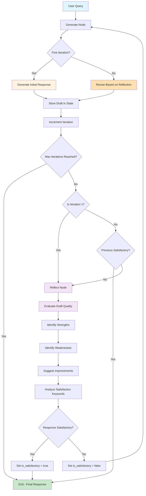
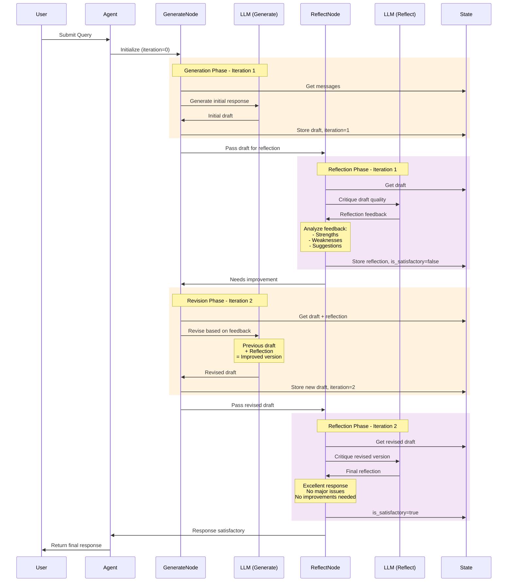

# Reflection Agent - Iterative Self-Improvement Pattern

## Table of Contents

- [Overview](#overview)
- [What is Reflection Pattern?](#what-is-reflection-pattern)
- [Architecture](#architecture)
- [How It Works](#how-it-works)
- [API Reference](#api-reference)
- [Usage Guide](#usage-guide)
- [Configuration](#configuration)
- [Examples](#examples)
- [Best Practices](#best-practices)
- [Comparison with Other Patterns](#comparison-with-other-patterns)
- [Advanced Features](#advanced-features)

## Overview

The **Reflection Agent** implements a self-improvement design pattern where an AI agent iteratively refines its responses through cycles of generation, reflection, and revision. This pattern produces higher-quality outputs than single-pass generation by leveraging the AI's ability to critique and improve its own work.

### Key Benefits

- ✅ **Higher Quality Outputs**: Multiple refinement cycles produce better results
- ✅ **Self-Correcting**: Agent identifies and fixes its own mistakes
- ✅ **Systematic Improvement**: Follows consistent evaluation criteria
- ✅ **Transparent Process**: Visible improvement iterations
- ✅ **Domain Adaptable**: Works across various use cases with custom prompts
- ✅ **Cost-Effective**: Achieves quality without human-in-the-loop

## What is Reflection Pattern?

Traditional single-pass generation:
```
User Query → LLM → Response
```

Reflection pattern with iterative improvement:
```
User Query → Generate → Reflect → Satisfied?
                ↑                     ↓ No
                └──── Revise ←────────┘
                         ↓ Yes
                   Final Response
```

### The Reflection Cycle

1. **Generate**: Create an initial response or revised version
2. **Reflect**: Critically evaluate the response quality
3. **Decide**: Determine if response is satisfactory
4. **Revise**: Generate improved version based on reflection (if needed)
5. **Repeat**: Continue until satisfactory or max iterations

### Inspiration

The Reflection pattern is inspired by:
- **Constitutional AI**: Self-critique and revision
- **Self-Refine**: Iterative refinement through feedback
- **Chain of Thought with Reflection**: Multi-step reasoning with self-evaluation

## Architecture

```
┌─────────────────────────────────────────────────────────────┐
│                   Reflection Agent                          │
├─────────────────────────────────────────────────────────────┤
│                                                             │
│  ┌──────────────┐      ┌──────────────┐                   │
│  │   Generate   │─────▶│   Reflect    │                   │
│  │    Node      │◀─────│    Node      │                   │
│  └──────────────┘      └──────────────┘                   │
│        │                      │                            │
│        │                      │                            │
│        ▼                      ▼                            │
│  Create/Revise         Evaluate Quality                   │
│   Response            Suggest Improvements                 │
│                                                             │
│  State: { draft, reflection, iteration, is_satisfactory } │
│                                                             │
└─────────────────────────────────────────────────────────────┘
```

### Components

1. **Generate Node**:
   - First iteration: Creates initial response
   - Later iterations: Revises based on reflection feedback
   - Tracks iteration count
   - Stores draft in state

2. **Reflect Node**:
   - Evaluates response quality
   - Identifies strengths and weaknesses
   - Suggests specific improvements
   - Determines if response is satisfactory

3. **Routing Logic**:
   - After Generate: Decides whether to reflect or finalize
   - After Reflect: Decides whether to revise or accept
   - Respects max iteration limit

4. **State Management**:
   - `messages`: Conversation history
   - `draft`: Current response version
   - `reflection`: Latest critique
   - `iteration`: Current cycle count
   - `is_satisfactory`: Quality indicator

## How It Works

### Complete Workflow Diagram



### Detailed Sequence Diagram



### State Evolution Example

```mermaid
stateDiagram-v2
    [*] --> Initial: User query received

    Initial --> Iteration1: Generate initial response
    state Iteration1 {
        [*] --> Generating1
        Generating1 --> Draft1: "CAP theorem is..."
        Draft1 --> [*]
    }

    Iteration1 --> Reflection1: Evaluate quality
    state Reflection1 {
        [*] --> Analyzing1
        Analyzing1 --> Feedback1: "Missing examples,<br/>needs more detail"
        Feedback1 --> [*]: is_satisfactory = false
    }

    Reflection1 --> Iteration2: Needs improvement
    state Iteration2 {
        [*] --> Revising2
        Revising2 --> Draft2: "CAP theorem...<br/>with examples"
        Draft2 --> [*]
    }

    Iteration2 --> Reflection2: Evaluate revised version
    state Reflection2 {
        [*] --> Analyzing2
        Analyzing2 --> Feedback2: "Comprehensive,<br/>no major issues"
        Feedback2 --> [*]: is_satisfactory = true
    }

    Reflection2 --> Final: Response approved
    Final --> [*]
```



## API Reference

### CreateReflectionAgent

Creates a new Reflection Agent with the specified configuration.

```go
func CreateReflectionAgent(config ReflectionAgentConfig) (*graph.StateRunnable, error)
```

#### Parameters

**ReflectionAgentConfig** structure:

```go
type ReflectionAgentConfig struct {
    // Model is the LLM to use for generation and reflection (required)
    Model llms.Model

    // ReflectionModel is an optional separate model for reflection
    // If nil, uses the same model as generation
    ReflectionModel llms.Model

    // MaxIterations is the maximum number of generation-reflection cycles
    // Default: 3
    MaxIterations int

    // SystemMessage is the system message for the generation step
    // Default: General helpful assistant prompt
    SystemMessage string

    // ReflectionPrompt is the system message for the reflection step
    // Default: Comprehensive evaluation criteria
    ReflectionPrompt string

    // Verbose enables detailed logging of the reflection process
    // Default: false
    Verbose bool
}
```

#### Returns

- **`*graph.StateRunnable`**: Compiled agent ready to execute
- **`error`**: Error if configuration is invalid

#### Example

```go
config := prebuilt.ReflectionAgentConfig{
    Model:         model,
    MaxIterations: 3,
    Verbose:       true,
}

agent, err := prebuilt.CreateReflectionAgent(config)
if err != nil {
    log.Fatal(err)
}
```

### State Structure

The agent maintains the following state channels:

```go
{
    "messages": []llms.MessageContent,    // Conversation history
    "draft": string,                      // Current response draft
    "reflection": string,                 // Latest reflection feedback
    "iteration": int,                     // Current iteration count (1-based)
    "is_satisfactory": bool,              // Whether response meets criteria
}
```

## Usage Guide

### Step 1: Create LLM Model

```go
import (
    "github.com/tmc/langchaingo/llms/openai"
)

model, err := openai.New(openai.WithModel("gpt-4"))
if err != nil {
    log.Fatal(err)
}
```

### Step 2: Configure Reflection Agent

```go
import (
    "github.com/smallnest/langgraphgo/prebuilt"
)

config := prebuilt.ReflectionAgentConfig{
    Model:         model,
    MaxIterations: 3,
    Verbose:       true,
}
```

### Step 3: Create Agent

```go
agent, err := prebuilt.CreateReflectionAgent(config)
if err != nil {
    log.Fatal(err)
}
```

### Step 4: Prepare Initial State

```go
initialState := map[string]interface{}{
    "messages": []llms.MessageContent{
        {
            Role:  llms.ChatMessageTypeHuman,
            Parts: []llms.ContentPart{
                llms.TextPart("Explain the CAP theorem in distributed systems"),
            },
        },
    },
}
```

### Step 5: Invoke Agent

```go
result, err := agent.Invoke(context.Background(), initialState)
if err != nil {
    log.Fatal(err)
}
```

### Step 6: Extract Results

```go
finalState := result.(map[string]interface{})

// Get final draft
draft := finalState["draft"].(string)

// Get iteration count
iteration := finalState["iteration"].(int)

// Get final reflection (if available)
reflection, _ := finalState["reflection"].(string)

fmt.Printf("Final response (after %d iterations):\n%s\n", iteration, draft)
```

## Configuration

### Basic Configuration

Minimal setup for quick start:

```go
config := prebuilt.ReflectionAgentConfig{
    Model: model,
}
```

### Custom System Message

Tailor generation to your domain:

```go
config := prebuilt.ReflectionAgentConfig{
    Model: model,
    SystemMessage: "You are an expert technical writer creating documentation for developers.",
}
```

### Custom Reflection Criteria

Define specific evaluation standards:

```go
config := prebuilt.ReflectionAgentConfig{
    Model: model,
    ReflectionPrompt: `Evaluate the documentation for:
1. **Accuracy**: Are all technical details correct?
2. **Completeness**: Does it cover all necessary aspects?
3. **Clarity**: Is it easy to understand?
4. **Examples**: Are there practical code examples?
5. **Structure**: Is the information well-organized?

Provide specific, actionable feedback.`,
}
```

### Separate Models for Generation and Reflection

Use different models to optimize cost or leverage specialized capabilities:

```go
generationModel, _ := openai.New(openai.WithModel("gpt-4"))
reflectionModel, _ := openai.New(openai.WithModel("gpt-3.5-turbo"))

config := prebuilt.ReflectionAgentConfig{
    Model:           generationModel,
    ReflectionModel: reflectionModel,
    MaxIterations:   3,
}
```

### Verbose Logging

Enable detailed output to understand the improvement process:

```go
config := prebuilt.ReflectionAgentConfig{
    Model:   model,
    Verbose: true,  // Shows generation, reflection, and decision logs
}
```

## Examples

### Example 1: Technical Explanation

Generate a well-refined technical explanation:

```go
config := prebuilt.ReflectionAgentConfig{
    Model:         model,
    MaxIterations: 3,
    Verbose:       true,
}

agent, _ := prebuilt.CreateReflectionAgent(config)

initialState := map[string]interface{}{
    "messages": []llms.MessageContent{
        {
            Role:  llms.ChatMessageTypeHuman,
            Parts: []llms.ContentPart{
                llms.TextPart("Explain the CAP theorem"),
            },
        },
    },
}

result, _ := agent.Invoke(context.Background(), initialState)
```

**Expected Process:**
1. **Iteration 1**: Generate basic explanation
2. **Reflection**: "Missing practical examples, could explain trade-offs better"
3. **Iteration 2**: Add examples and trade-off discussion
4. **Reflection**: "Comprehensive, well-structured, no major issues"
5. **Complete**: Return final improved explanation

### Example 2: API Documentation

Create high-quality API documentation:

```go
config := prebuilt.ReflectionAgentConfig{
    Model:         model,
    MaxIterations: 2,
    SystemMessage: "You are an API documentation expert.",
    ReflectionPrompt: `Evaluate for:
1. Clear endpoint description
2. Complete parameter documentation
3. Example requests and responses
4. Error handling documentation`,
}

agent, _ := prebuilt.CreateReflectionAgent(config)

initialState := map[string]interface{}{
    "messages": []llms.MessageContent{
        {
            Role:  llms.ChatMessageTypeHuman,
            Parts: []llms.ContentPart{
                llms.TextPart("Document a POST /users endpoint that creates a user"),
            },
        },
    },
}
```

### Example 3: Code Review

Provide thoughtful code review feedback:

```go
config := prebuilt.ReflectionAgentConfig{
    Model:         model,
    MaxIterations: 2,
    SystemMessage: "You are a senior software engineer providing code review.",
    ReflectionPrompt: `Evaluate the review for:
1. Constructiveness and professionalism
2. Identification of real issues
3. Specific, actionable suggestions
4. Balance of strengths and weaknesses`,
}
```

### Example 4: Content Creation

Generate engaging blog content:

```go
config := prebuilt.ReflectionAgentConfig{
    Model:         model,
    MaxIterations: 3,
    SystemMessage: "You are a skilled content writer creating engaging technical articles.",
    ReflectionPrompt: `Evaluate for:
1. Engagement: Is it interesting to read?
2. Structure: Is it well-organized?
3. Clarity: Is it easy to understand?
4. Value: Does it provide practical insights?`,
}
```

## Best Practices

### 1. Choose Appropriate Iteration Counts

| Task Complexity | Recommended Iterations |
|----------------|----------------------|
| Simple explanations | 2-3 |
| Technical documentation | 3-4 |
| Critical content | 4-5 |
| Creative writing | 3-5 |

### 2. Craft Effective Reflection Prompts

✅ **Good** - Specific criteria:
```go
ReflectionPrompt: `Evaluate for:
1. Technical accuracy
2. Completeness
3. Code examples
4. Error handling coverage`
```

❌ **Bad** - Vague:
```go
ReflectionPrompt: "Check if the response is good"
```

### 3. Use Verbose Mode During Development

```go
config := prebuilt.ReflectionAgentConfig{
    Verbose: true,  // See what's happening at each step
}
```

This helps you:
- Understand how the agent improves responses
- Identify if reflection prompts are effective
- Debug satisfaction detection issues

### 4. Balance Cost and Quality

**Option 1: Same model** (Consistent, simpler)
```go
config := prebuilt.ReflectionAgentConfig{
    Model: gpt4Model,
}
```

**Option 2: Different models** (Cost-optimized)
```go
config := prebuilt.ReflectionAgentConfig{
    Model:           gpt4Model,        // Quality generation
    ReflectionModel: gpt35Model,       // Faster reflection
}
```

### 5. Set Realistic Iteration Limits

```go
// Don't set too high - diminishing returns after 3-5 iterations
config := prebuilt.ReflectionAgentConfig{
    MaxIterations: 3,  // Usually sufficient
}
```

### 6. Handle Edge Cases

```go
result, err := agent.Invoke(ctx, initialState)
if err != nil {
    log.Printf("Agent error: %v", err)
    return
}

finalState := result.(map[string]interface{})

// Check if max iterations reached without satisfaction
iteration := finalState["iteration"].(int)
isSatisfactory, _ := finalState["is_satisfactory"].(bool)

if iteration >= maxIterations && !isSatisfactory {
    log.Println("Warning: Reached max iterations without satisfactory response")
}
```

## Comparison with Other Patterns

| Feature | Single-Pass | ReAct | Planning | Reflection |
|---------|------------|-------|----------|------------|
| **Quality** | Variable | Good | Good | High |
| **Iterations** | 1 | Variable | 1-2 | Controlled |
| **Self-Critique** | No | No | No | Yes |
| **Tool Use** | Optional | Yes | Optional | Optional |
| **Planning** | No | No | Yes | No |
| **Refinement** | No | Limited | No | Yes |
| **Use Case** | Simple tasks | Tool calling | Complex workflows | Quality writing |
| **Latency** | Low | Medium | Medium | High |
| **Cost** | Low | Medium | Medium | High |
| **Best For** | Quick answers | Action tasks | Multi-step tasks | High-quality content |

## Advanced Features

### Custom Satisfaction Detection

Override the default satisfaction logic:

```go
// In your implementation, you could:
// 1. Call LLM to rate response (1-10)
// 2. Use sentiment analysis on reflection
// 3. Check specific keywords or patterns
// 4. Validate against requirements checklist
```

### Combining with Tools

While Reflection Agent focuses on quality refinement, you can combine it with tools:

```go
// Use ReAct agent for tool calling, then Reflection for quality
reactResult := reactAgent.Invoke(ctx, query)
reflectionInput := createReflectionInput(reactResult)
finalResult := reflectionAgent.Invoke(ctx, reflectionInput)
```

### Multi-Stage Reflection

Implement different reflection criteria at different stages:

```go
// Stage 1: Content completeness
stage1Config := prebuilt.ReflectionAgentConfig{
    Model: model,
    ReflectionPrompt: "Check if all required topics are covered",
    MaxIterations: 2,
}

// Stage 2: Quality polish
stage2Config := prebuilt.ReflectionAgentConfig{
    Model: model,
    ReflectionPrompt: "Check writing quality, examples, and clarity",
    MaxIterations: 2,
}
```

### Persistence and Checkpointing

Save intermediate drafts for recovery:

```go
// After each iteration, save state
finalState := result.(map[string]interface{})
saveCheckpoint(finalState["draft"].(string), finalState["iteration"].(int))
```

## Use Cases

### 1. Documentation Generation
Create comprehensive, accurate technical documentation that improves through self-review.

### 2. Content Writing
Generate blog posts, articles, and educational content with multiple refinement cycles.

### 3. Code Review
Provide thorough, constructive code review feedback that's balanced and actionable.

### 4. Technical Explanations
Produce clear, accurate explanations of complex technical concepts.

### 5. Report Writing
Generate detailed reports with proper structure, analysis, and recommendations.

### 6. Email Drafting
Create professional emails that are clear, concise, and appropriately toned.

### 7. Creative Writing
Generate stories, scripts, or creative content with iterative improvement.

### 8. Resume/Cover Letters
Create polished professional documents through self-refinement.

## Troubleshooting

### Issue: Agent Always Stops After First Iteration

**Symptom**: Response finalized without reflection

**Causes**:
1. Reflection prompt too lenient
2. Satisfaction detection too sensitive

**Solutions**:
```go
// Make reflection more critical
config := prebuilt.ReflectionAgentConfig{
    ReflectionPrompt: `Be thorough in identifying issues.
    Even good responses can be improved.
    Focus on: [specific criteria]`,
}
```

### Issue: Agent Always Reaches Max Iterations

**Symptom**: Never satisfied, always revising

**Causes**:
1. Reflection prompt too critical
2. Unrealistic quality expectations
3. Satisfaction keywords not matching

**Solutions**:
```go
// Be more balanced in reflection
config := prebuilt.ReflectionAgentConfig{
    ReflectionPrompt: `Provide balanced feedback.
    If response is good, acknowledge it clearly.
    Use "No major issues" when appropriate.`,
    MaxIterations: 5,  // Increase if needed
}
```

### Issue: Generic Reflections

**Symptom**: Reflections don't provide actionable feedback

**Solution**: Add specific evaluation criteria
```go
config := prebuilt.ReflectionAgentConfig{
    ReflectionPrompt: `Evaluate using these specific criteria:
    1. [Criterion 1]: Check for [specific aspect]
    2. [Criterion 2]: Verify [specific element]
    ...

    For each criterion, provide:
    - Current status (✓ or ✗)
    - Specific issue if present
    - Concrete improvement suggestion`,
}
```

### Issue: Repetitive Revisions

**Symptom**: Each iteration produces similar content

**Causes**:
1. Reflection not clear enough
2. Model not understanding feedback

**Solutions**:
```go
// Make reflection more specific
config := prebuilt.ReflectionAgentConfig{
    ReflectionPrompt: `When suggesting improvements:
    1. Quote the exact text that needs change
    2. Explain why it's insufficient
    3. Provide example of better version`,
}
```

## Performance Considerations

### Latency

- **Single iteration**: ~1-2 LLM calls
- **Three iterations**: ~6 LLM calls (3 generate + 3 reflect)
- **Parallel unavailable**: Sequential by design

### Cost Optimization

```go
// Use cheaper model for reflection
config := prebuilt.ReflectionAgentConfig{
    Model:           openai.New(openai.WithModel("gpt-4")),
    ReflectionModel: openai.New(openai.WithModel("gpt-3.5-turbo")),
}

// Or reduce max iterations for less critical tasks
config := prebuilt.ReflectionAgentConfig{
    MaxIterations: 2,  // vs 3-5
}
```

### Quality vs Speed Trade-off

| Priority | Configuration | Use Case |
|----------|--------------|----------|
| **Speed** | 1-2 iterations, GPT-3.5 | Quick drafts, internal docs |
| **Balanced** | 2-3 iterations, GPT-4 | Most use cases |
| **Quality** | 4-5 iterations, GPT-4 | Critical content, publications |

## Next Steps

1. **Try the Example**: Run `examples/reflection_agent/main.go`
2. **Experiment with Prompts**: Test different reflection criteria
3. **Compare Models**: Try different model combinations
4. **Measure Quality**: Track improvement metrics
5. **Integrate**: Add to your application workflow

## References

- [Reflection Agent Example](../examples/reflection_agent/)
- [Constitutional AI Paper](https://arxiv.org/abs/2212.08073)
- [Self-Refine Paper](https://arxiv.org/abs/2303.17651)
- [LangGraph Reflection Pattern](https://langchain-ai.github.io/langgraph/concepts/reflection/)
- [ReAct Agent](./REACTAGENT_README.md)
- [Planning Agent](./PLANNINGAGENT_README.md)
