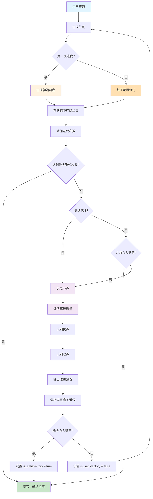
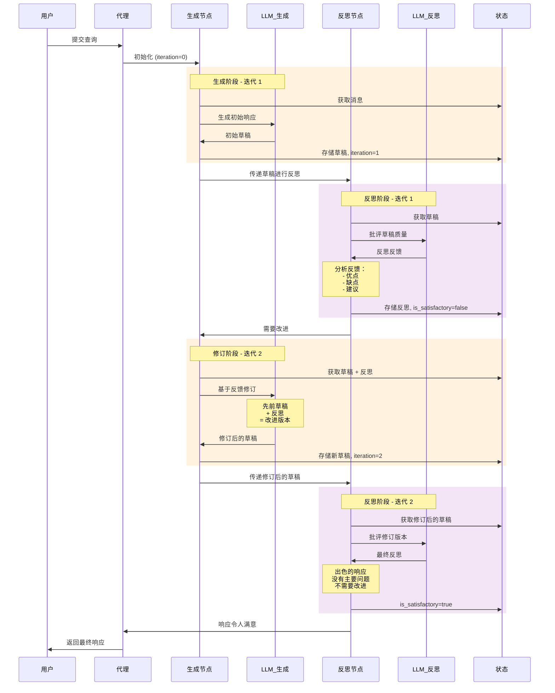
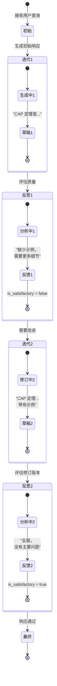

# Reflection Agent - 迭代自我改进模式

## 目录

- [概述](#概述)
- [什么是 Reflection 模式？](#什么是-reflection-模式)
- [架构](#架构)
- [工作原理](#工作原理)
- [API 参考](#api-参考)
- [使用指南](#使用指南)
- [配置](#配置)
- [示例](#示例)
- [最佳实践](#最佳实践)
- [与其他模式的比较](#与其他模式的比较)
- [高级特性](#高级特性)

## 概述

**Reflection Agent（反思代理）** 实现了一种自我改进的设计模式，AI 代理通过生成、反思和修订的循环迭代地精炼其响应。这种模式通过利用 AI 批评和改进自己工作的能力，产生比单次生成更高质量的输出。

### 核心优势

- ✅ **更高质量输出**：多次精炼循环产生更好的结果
- ✅ **自我纠正**：代理识别并修复自己的错误
- ✅ **系统性改进**：遵循一致的评估标准
- ✅ **透明过程**：可见的改进迭代
- ✅ **领域适应性**：通过自定义提示适用于各种用例
- ✅ **成本效益**：无需人工参与即可实现质量提升

## 什么是 Reflection 模式？

传统的单次生成：
```
用户查询 → LLM → 响应
```

带有迭代改进的 Reflection 模式：
```
用户查询 → 生成 → 反思 → 满意？
            ↑              ↓ 否
            └──── 修订 ←────┘
                   ↓ 是
              最终响应
```

### Reflection 循环

1. **生成**：创建初始响应或修订版本
2. **反思**：批判性地评估响应质量
3. **决策**：确定响应是否令人满意
4. **修订**：基于反思生成改进版本（如需要）
5. **重复**：继续直到满意或达到最大迭代次数

### 灵感来源

Reflection 模式受以下研究启发：
- **Constitutional AI**：自我批评和修订
- **Self-Refine**：通过反馈进行迭代精炼
- **带反思的思维链**：带有自我评估的多步推理

## 架构

```
┌─────────────────────────────────────────────────────────────┐
│                   Reflection Agent                          │
├─────────────────────────────────────────────────────────────┤
│                                                             │
│  ┌──────────────┐      ┌──────────────┐                   │
│  │   生成节点   │─────▶│   反思节点   │                   │
│  │   Generate   │◀─────│   Reflect    │                   │
│  └──────────────┘      └──────────────┘                   │
│        │                      │                            │
│        │                      │                            │
│        ▼                      ▼                            │
│  创建/修订               评估质量                          │
│   响应                  提出改进建议                        │
│                                                             │
│  状态: { draft, reflection, iteration, is_satisfactory }  │
│                                                             │
└─────────────────────────────────────────────────────────────┘
```

### 组件

1. **生成节点（Generate Node）**：
   - 第一次迭代：创建初始响应
   - 后续迭代：基于反思反馈进行修订
   - 跟踪迭代计数
   - 在状态中存储草稿

2. **反思节点（Reflect Node）**：
   - 评估响应质量
   - 识别优点和缺点
   - 提出具体改进建议
   - 确定响应是否令人满意

3. **路由逻辑**：
   - 生成后：决定是反思还是完成
   - 反思后：决定是修订还是接受
   - 遵守最大迭代限制

4. **状态管理**：
   - `messages`：对话历史
   - `draft`：当前响应版本
   - `reflection`：最新批评
   - `iteration`：当前循环计数
   - `is_satisfactory`：质量指标

## 工作原理

### 完整工作流程图



### 详细序列图



### 状态演化示例



## API 参考

### CreateReflectionAgent

使用指定配置创建新的 Reflection Agent。

```go
func CreateReflectionAgent(config ReflectionAgentConfig) (*graph.StateRunnable, error)
```

#### 参数

**ReflectionAgentConfig** 结构：

```go
type ReflectionAgentConfig struct {
    // Model 是用于生成和反思的 LLM（必需）
    Model llms.Model

    // ReflectionModel 是可选的独立反思模型
    // 如果为 nil，使用与生成相同的模型
    ReflectionModel llms.Model

    // MaxIterations 是生成-反思循环的最大次数
    // 默认：3
    MaxIterations int

    // SystemMessage 是生成步骤的系统消息
    // 默认：通用的有用助手提示
    SystemMessage string

    // ReflectionPrompt 是反思步骤的系统消息
    // 默认：全面的评估标准
    ReflectionPrompt string

    // Verbose 启用反思过程的详细日志
    // 默认：false
    Verbose bool
}
```

#### 返回值

- **`*graph.StateRunnable`**：编译好的代理，准备执行
- **`error`**：如果配置无效则返回错误

#### 示例

```go
config := prebuilt.ReflectionAgentConfig{
    Model:         model,
    MaxIterations: 3,
    Verbose:       true,
}

agent, err := prebuilt.CreateReflectionAgent(config)
if err != nil {
    log.Fatal(err)
}
```

### 状态结构

代理维护以下状态通道：

```go
{
    "messages": []llms.MessageContent,    // 对话历史
    "draft": string,                      // 当前响应草稿
    "reflection": string,                 // 最新反思反馈
    "iteration": int,                     // 当前迭代次数（从 1 开始）
    "is_satisfactory": bool,              // 响应是否满足标准
}
```

## 使用指南

### 步骤 1：创建 LLM 模型

```go
import (
    "github.com/tmc/langchaingo/llms/openai"
)

model, err := openai.New(openai.WithModel("gpt-4"))
if err != nil {
    log.Fatal(err)
}
```

### 步骤 2：配置 Reflection Agent

```go
import (
    "github.com/smallnest/langgraphgo/prebuilt"
)

config := prebuilt.ReflectionAgentConfig{
    Model:         model,
    MaxIterations: 3,
    Verbose:       true,
}
```

### 步骤 3：创建代理

```go
agent, err := prebuilt.CreateReflectionAgent(config)
if err != nil {
    log.Fatal(err)
}
```

### 步骤 4：准备初始状态

```go
initialState := map[string]interface{}{
    "messages": []llms.MessageContent{
        {
            Role:  llms.ChatMessageTypeHuman,
            Parts: []llms.ContentPart{
                llms.TextPart("解释分布式系统中的 CAP 定理"),
            },
        },
    },
}
```

### 步骤 5：调用代理

```go
result, err := agent.Invoke(context.Background(), initialState)
if err != nil {
    log.Fatal(err)
}
```

### 步骤 6：提取结果

```go
finalState := result.(map[string]interface{})

// 获取最终草稿
draft := finalState["draft"].(string)

// 获取迭代次数
iteration := finalState["iteration"].(int)

// 获取最终反思（如果可用）
reflection, _ := finalState["reflection"].(string)

fmt.Printf("最终响应（经过 %d 次迭代）：\n%s\n", iteration, draft)
```

## 配置

### 基本配置

快速开始的最小设置：

```go
config := prebuilt.ReflectionAgentConfig{
    Model: model,
}
```

### 自定义系统消息

为您的领域定制生成：

```go
config := prebuilt.ReflectionAgentConfig{
    Model: model,
    SystemMessage: "你是一位为开发者创建文档的专业技术写作者。",
}
```

### 自定义反思标准

定义具体的评估标准：

```go
config := prebuilt.ReflectionAgentConfig{
    Model: model,
    ReflectionPrompt: `评估文档的以下方面：
1. **准确性**：所有技术细节是否正确？
2. **完整性**：是否涵盖所有必要方面？
3. **清晰度**：是否易于理解？
4. **示例**：是否有实际代码示例？
5. **结构**：信息是否组织良好？

提供具体、可操作的反馈。`,
}
```

### 生成和反思使用不同模型

使用不同模型来优化成本或利用专门能力：

```go
generationModel, _ := openai.New(openai.WithModel("gpt-4"))
reflectionModel, _ := openai.New(openai.WithModel("gpt-3.5-turbo"))

config := prebuilt.ReflectionAgentConfig{
    Model:           generationModel,
    ReflectionModel: reflectionModel,
    MaxIterations:   3,
}
```

### 详细日志

启用详细输出以理解改进过程：

```go
config := prebuilt.ReflectionAgentConfig{
    Model:   model,
    Verbose: true,  // 显示生成、反思和决策日志
}
```

## 示例

### 示例 1：技术解释

生成经过良好精炼的技术解释：

```go
config := prebuilt.ReflectionAgentConfig{
    Model:         model,
    MaxIterations: 3,
    Verbose:       true,
}

agent, _ := prebuilt.CreateReflectionAgent(config)

initialState := map[string]interface{}{
    "messages": []llms.MessageContent{
        {
            Role:  llms.ChatMessageTypeHuman,
            Parts: []llms.ContentPart{
                llms.TextPart("解释 CAP 定理"),
            },
        },
    },
}

result, _ := agent.Invoke(context.Background(), initialState)
```

**预期过程：**
1. **迭代 1**：生成基本解释
2. **反思**："缺少实际示例，可以更好地解释权衡"
3. **迭代 2**：添加示例和权衡讨论
4. **反思**："全面，结构良好，没有主要问题"
5. **完成**：返回最终改进的解释

### 示例 2：API 文档

创建高质量的 API 文档：

```go
config := prebuilt.ReflectionAgentConfig{
    Model:         model,
    MaxIterations: 2,
    SystemMessage: "你是一位 API 文档专家。",
    ReflectionPrompt: `评估以下方面：
1. 清晰的端点描述
2. 完整的参数文档
3. 示例请求和响应
4. 错误处理文档`,
}

agent, _ := prebuilt.CreateReflectionAgent(config)

initialState := map[string]interface{}{
    "messages": []llms.MessageContent{
        {
            Role:  llms.ChatMessageTypeHuman,
            Parts: []llms.ContentPart{
                llms.TextPart("为创建用户的 POST /users 端点编写文档"),
            },
        },
    },
}
```

### 示例 3：代码审查

提供周到的代码审查反馈：

```go
config := prebuilt.ReflectionAgentConfig{
    Model:         model,
    MaxIterations: 2,
    SystemMessage: "你是一位提供代码审查的高级软件工程师。",
    ReflectionPrompt: `评估审查的以下方面：
1. 建设性和专业性
2. 识别真实问题
3. 具体、可操作的建议
4. 优点和缺点的平衡`,
}
```

### 示例 4：内容创作

生成引人入胜的博客内容：

```go
config := prebuilt.ReflectionAgentConfig{
    Model:         model,
    MaxIterations: 3,
    SystemMessage: "你是一位创建引人入胜技术文章的熟练内容写作者。",
    ReflectionPrompt: `评估以下方面：
1. 吸引力：阅读起来是否有趣？
2. 结构：是否组织良好？
3. 清晰度：是否易于理解？
4. 价值：是否提供实用见解？`,
}
```

## 最佳实践

### 1. 选择合适的迭代次数

| 任务复杂度 | 推荐迭代次数 |
|-----------|-------------|
| 简单解释 | 2-3 |
| 技术文档 | 3-4 |
| 关键内容 | 4-5 |
| 创意写作 | 3-5 |

### 2. 制定有效的反思提示

✅ **好** - 具体标准：
```go
ReflectionPrompt: `评估以下方面：
1. 技术准确性
2. 完整性
3. 代码示例
4. 错误处理覆盖`
```

❌ **差** - 模糊：
```go
ReflectionPrompt: "检查响应是否良好"
```

### 3. 在开发期间使用详细模式

```go
config := prebuilt.ReflectionAgentConfig{
    Verbose: true,  // 查看每一步发生了什么
}
```

这有助于您：
- 理解代理如何改进响应
- 识别反思提示是否有效
- 调试满意度检测问题

### 4. 平衡成本和质量

**选项 1：相同模型**（一致，更简单）
```go
config := prebuilt.ReflectionAgentConfig{
    Model: gpt4Model,
}
```

**选项 2：不同模型**（成本优化）
```go
config := prebuilt.ReflectionAgentConfig{
    Model:           gpt4Model,        // 质量生成
    ReflectionModel: gpt35Model,       // 更快反思
}
```

### 5. 设置合理的迭代限制

```go
// 不要设置太高 - 3-5 次迭代后收益递减
config := prebuilt.ReflectionAgentConfig{
    MaxIterations: 3,  // 通常足够
}
```

### 6. 处理边缘情况

```go
result, err := agent.Invoke(ctx, initialState)
if err != nil {
    log.Printf("代理错误：%v", err)
    return
}

finalState := result.(map[string]interface{})

// 检查是否在未满意的情况下达到最大迭代次数
iteration := finalState["iteration"].(int)
isSatisfactory, _ := finalState["is_satisfactory"].(bool)

if iteration >= maxIterations && !isSatisfactory {
    log.Println("警告：达到最大迭代次数但响应仍不令人满意")
}
```

## 与其他模式的比较

| 特性 | 单次生成 | ReAct | Planning | Reflection |
|------|---------|-------|----------|------------|
| **质量** | 可变 | 好 | 好 | 高 |
| **迭代次数** | 1 | 可变 | 1-2 | 可控 |
| **自我批评** | 否 | 否 | 否 | 是 |
| **工具使用** | 可选 | 是 | 可选 | 可选 |
| **规划** | 否 | 否 | 是 | 否 |
| **精炼** | 否 | 有限 | 否 | 是 |
| **使用场景** | 简单任务 | 工具调用 | 复杂工作流 | 高质量写作 |
| **延迟** | 低 | 中 | 中 | 高 |
| **成本** | 低 | 中 | 中 | 高 |
| **最适合** | 快速回答 | 动作任务 | 多步任务 | 高质量内容 |

## 高级特性

### 自定义满意度检测

覆盖默认满意度逻辑：

```go
// 在您的实现中，您可以：
// 1. 调用 LLM 为响应评分（1-10）
// 2. 对反思使用情感分析
// 3. 检查特定关键词或模式
// 4. 根据需求清单验证
```

### 与工具结合

虽然 Reflection Agent 专注于质量精炼，但您可以将其与工具结合：

```go
// 使用 ReAct 代理进行工具调用，然后使用 Reflection 提高质量
reactResult := reactAgent.Invoke(ctx, query)
reflectionInput := createReflectionInput(reactResult)
finalResult := reflectionAgent.Invoke(ctx, reflectionInput)
```

### 多阶段反思

在不同阶段实施不同的反思标准：

```go
// 阶段 1：内容完整性
stage1Config := prebuilt.ReflectionAgentConfig{
    Model: model,
    ReflectionPrompt: "检查是否涵盖所有必需主题",
    MaxIterations: 2,
}

// 阶段 2：质量润色
stage2Config := prebuilt.ReflectionAgentConfig{
    Model: model,
    ReflectionPrompt: "检查写作质量、示例和清晰度",
    MaxIterations: 2,
}
```

### 持久化和检查点

保存中间草稿以便恢复：

```go
// 每次迭代后，保存状态
finalState := result.(map[string]interface{})
saveCheckpoint(finalState["draft"].(string), finalState["iteration"].(int))
```

## 使用场景

### 1. 文档生成
创建通过自我审查改进的全面、准确的技术文档。

### 2. 内容写作
生成经过多次精炼循环的博客文章、文章和教育内容。

### 3. 代码审查
提供全面、建设性且可操作的代码审查反馈。

### 4. 技术解释
产生对复杂技术概念的清晰、准确的解释。

### 5. 报告撰写
生成具有适当结构、分析和建议的详细报告。

### 6. 电子邮件起草
创建清晰、简洁且语气适当的专业电子邮件。

### 7. 创意写作
通过迭代改进生成故事、剧本或创意内容。

### 8. 简历/求职信
通过自我精炼创建精美的专业文档。

## 故障排除

### 问题：代理总是在第一次迭代后停止

**症状**：响应未经反思就完成

**原因**：
1. 反思提示太宽松
2. 满意度检测太敏感

**解决方案**：
```go
// 使反思更加挑剔
config := prebuilt.ReflectionAgentConfig{
    ReflectionPrompt: `在识别问题时要彻底。
    即使是好的响应也可以改进。
    关注：[具体标准]`,
}
```

### 问题：代理总是达到最大迭代次数

**症状**：从不满意，总是修订

**原因**：
1. 反思提示太挑剔
2. 质量期望不切实际
3. 满意度关键词不匹配

**解决方案**：
```go
// 在反思中更加平衡
config := prebuilt.ReflectionAgentConfig{
    ReflectionPrompt: `提供平衡的反馈。
    如果响应良好，请明确承认。
    适当时使用"没有主要问题"。`,
    MaxIterations: 5,  // 如需要可增加
}
```

### 问题：泛泛的反思

**症状**：反思没有提供可操作的反馈

**解决方案**：添加具体的评估标准
```go
config := prebuilt.ReflectionAgentConfig{
    ReflectionPrompt: `使用以下具体标准进行评估：
    1. [标准 1]：检查 [具体方面]
    2. [标准 2]：验证 [具体元素]
    ...

    对于每个标准，提供：
    - 当前状态（✓ 或 ✗）
    - 如果存在则说明具体问题
    - 具体改进建议`,
}
```

### 问题：重复性修订

**症状**：每次迭代产生相似的内容

**原因**：
1. 反思不够清晰
2. 模型不理解反馈

**解决方案**：
```go
// 使反思更具体
config := prebuilt.ReflectionAgentConfig{
    ReflectionPrompt: `在提出改进建议时：
    1. 引用需要更改的确切文本
    2. 解释为什么不够充分
    3. 提供更好版本的示例`,
}
```

## 性能考虑

### 延迟

- **单次迭代**：约 1-2 次 LLM 调用
- **三次迭代**：约 6 次 LLM 调用（3 次生成 + 3 次反思）
- **不可并行**：设计上是顺序的

### 成本优化

```go
// 为反思使用更便宜的模型
config := prebuilt.ReflectionAgentConfig{
    Model:           openai.New(openai.WithModel("gpt-4")),
    ReflectionModel: openai.New(openai.WithModel("gpt-3.5-turbo")),
}

// 或减少不太关键任务的最大迭代次数
config := prebuilt.ReflectionAgentConfig{
    MaxIterations: 2,  // vs 3-5
}
```

### 质量与速度权衡

| 优先级 | 配置 | 使用场景 |
|--------|------|----------|
| **速度** | 1-2 次迭代，GPT-3.5 | 快速草稿，内部文档 |
| **平衡** | 2-3 次迭代，GPT-4 | 大多数用例 |
| **质量** | 4-5 次迭代，GPT-4 | 关键内容，出版物 |

## 下一步

1. **尝试示例**：运行 `examples/reflection_agent/main.go`
2. **尝试提示**：测试不同的反思标准
3. **比较模型**：尝试不同的模型组合
4. **测量质量**：跟踪改进指标
5. **集成**：添加到您的应用程序工作流中

## 参考

- [Reflection Agent 示例](../examples/reflection_agent/)
- [Constitutional AI 论文](https://arxiv.org/abs/2212.08073)
- [Self-Refine 论文](https://arxiv.org/abs/2303.17651)
- [LangGraph Reflection 模式](https://langchain-ai.github.io/langgraph/concepts/reflection/)
- [ReAct Agent](./REACTAGENT_README_CN.md)
- [Planning Agent](./PLANNINGAGENT_README_CN.md)
