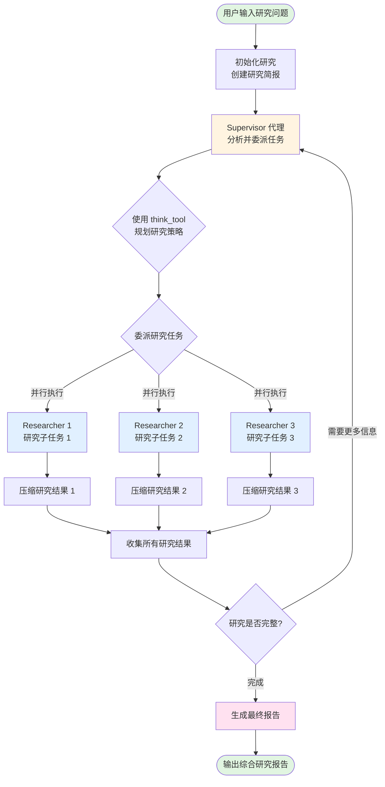
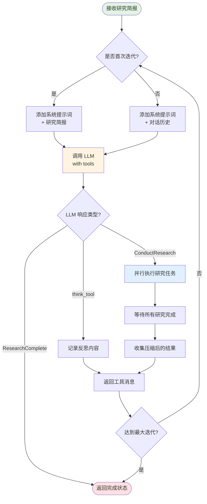
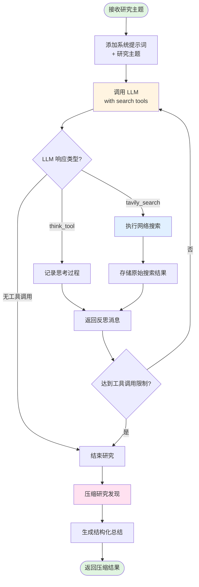
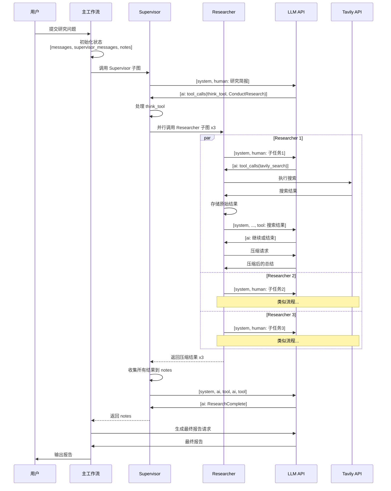

# Open Deep Research 流程图

## 整体架构流程



## Supervisor 工作流详细流程



## Researcher 工作流详细流程



## 状态管理和消息流



## 数据流图

```mermaid
graph LR
    subgraph 输入
        Q[用户查询]
    end
    
    subgraph 初始化
        Q --> Brief[研究简报]
        Brief --> State1[初始状态<br/>messages: []<br/>supervisor_messages: []<br/>notes: []]
    end
    
    subgraph Supervisor循环
        State1 --> SM1[supervisor_messages<br/>+ AI message]
        SM1 --> SM2[supervisor_messages<br/>+ tool messages]
        SM2 --> Notes[notes<br/>+ 研究结果]
    end
    
    subgraph Researcher并行
        SM1 -.委派.-> R1State[Researcher 1<br/>messages: []]
        SM1 -.委派.-> R2State[Researcher 2<br/>messages: []]
        SM1 -.委派.-> R3State[Researcher 3<br/>messages: []]
        
        R1State --> R1Notes[raw_notes<br/>+ 搜索结果]
        R2State --> R2Notes[raw_notes<br/>+ 搜索结果]
        R3State --> R3Notes[raw_notes<br/>+ 搜索结果]
        
        R1Notes --> R1Comp[compressed_research]
        R2Notes --> R2Comp[compressed_research]
        R3Notes --> R3Comp[compressed_research]
        
        R1Comp -.返回.-> SM2
        R2Comp -.返回.-> SM2
        R3Comp -.返回.-> SM2
    end
    
    subgraph 最终报告
        Notes --> Findings[所有研究发现]
        Findings --> FinalReport[最终报告]
    end
    
    subgraph 输出
        FinalReport --> Output[综合研究报告]
    end
    
    style Q fill:#e1f5e1
    style Output fill:#e1f5e1
    style SM1 fill:#fff4e1
    style R1Comp fill:#e1f0ff
    style R2Comp fill:#e1f0ff
    style R3Comp fill:#e1f0ff
    style FinalReport fill:#ffe1f0
```

## 关键概念说明

### 1. 状态累积
- 使用 `AppendReducer` 累积消息历史
- 每个节点返回的消息会追加到状态中
- 保持完整的对话上下文

### 2. 消息序列
正确的消息顺序：
```
[system] -> [human] -> [ai with tool_calls] -> [tool responses] -> [ai] -> ...
```

### 3. 并行执行
- Supervisor 使用 goroutines 并行调用多个 Researcher
- 使用 channels 收集结果
- 限制最大并发数量

### 4. 迭代控制
- Supervisor: `MAX_RESEARCHER_ITERATIONS` (默认 10)
- Researcher: `MAX_TOOL_CALL_ITERATIONS` (默认 20)
- 防止无限循环

### 5. 子图集成
- Supervisor 和 Researcher 都是独立的子图
- 每个子图有自己的 schema 和 reducers
- 主图协调子图的执行
